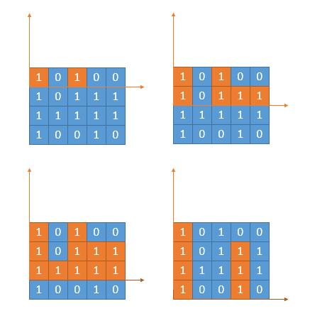

#### [85. 最大矩形](https://leetcode-cn.com/problems/maximal-rectangle/)[85. 最大矩形](https://leetcode-cn.com/problems/maximal-rectangle/)

[题解](https://leetcode-cn.com/problems/maximal-rectangle/solution/xiang-xi-tong-su-de-si-lu-fen-xi-duo-jie-fa-by-1-8/)

## 方法一：二维前缀和（超时）

最先想到的方法

时间复杂度：`O(rows*cols*rows*cols)` 10^8

空间复杂度：`O(rows*cols)`

```c++
class Solution {
public:
    int maximalRectangle(vector<vector<char>>& matrix) {
        int rows = matrix.size();
        int cols = matrix[0].size();
        vector<vector<int>> preSum(rows + 1, vector<int>(cols + 1, 0));
        // show(preSum);

        for (int r = 0; r < rows; r++) {
            for (int c = 0; c < cols; c++) {
                preSum[r + 1][c + 1] = preSum[r][c + 1] + preSum[r + 1][c] - preSum[r][c] + matrix[r][c] - 48;
            }
        }

        // 固定每个矩形的右下角，遍历左上角,这里使用前缀和中的坐标
        int ans = 0;
        for (int d_r = 1; d_r < rows + 1; d_r++) {
            for (int d_c = 1; d_c < cols + 1; d_c++) {
                for (int u_r = 1; u_r <= d_r; u_r++) {
                    for (int u_c = 1; u_c <= d_c; u_c++) {
                        int area = preSum[d_r][d_c] - preSum[d_r][u_c - 1] - preSum[u_r - 1][d_c] + preSum[u_r - 1][u_c - 1];
                        // cout << area << endl;
                        if (area == (d_r - u_r + 1) * (d_c - u_c + 1)) {
                            ans = max(ans, area);
                        }
                    }
                }
            }
        }
        return ans;
    }
};
```

## 方法二：暴力

固定每个矩形的右下角

**用 lengths 二维数组，保存横向上以当前点（矩形右下角）结尾的连续 1 的个数**

时间复杂度：`O(rows*cols*rows)` 10^6

空间复杂度：`O(rows*cols)`

```c++
class Solution {
public:
    int maximalRectangle(vector<vector<char>>& matrix) {
        int ans;
        int rows = matrix.size();
        int cols = matrix[0].size();
        vector<vector<int>> lengths(rows, vector<int>(cols, 0));

        for (int r = 0; r < rows; r++) {
            for (int c = 0; c < cols; c++) {
                // 更新横向上以当前点（矩形右下角）结尾的连续 1 的个数
                if (matrix[r][c] == '1') {
                    if (c == 0) {
                        lengths[r][c] = 1;
                    } else {
                        lengths[r][c] = lengths[r][c - 1] + 1;
                    }
                } else {
                    lengths[r][c] = 0;
                }
                // 初始化矩形的底边长，默认值的最下面一行的长
                // 随着往上遍历，底边长会不断更新为：从下到上最短的那个
                int minLength = lengths[r][c];
                for (int up_r = r; up_r >= 0; up_r--) {
                    minLength = min(minLength, lengths[up_r][c]);
                    int heigth = r - up_r + 1;
                    ans = max(ans, minLength * heigth);
                }
            }
        }
        return ans;
    }
};
```

## 方法三：单调栈

求出每一层的 heights 然后传给 [84题](./84-[单调栈]-柱状图中最大的矩形.md) 的函数

**用 heights 二维数组，保存纵向上以当前点为底的连续 1 的个数**



时间复杂度：`O(rows*cols)` 10^4

空间复杂度：`O(rows*cols)` 其实也可以做到 `O(cols)`

```c++
class Solution {
public:
    int largestRectangleArea(vector<int> heights) {
        int ans = 0;
        heights.insert(heights.begin(), 0);
        heights.push_back(0);
        vector<int> stack = {0};
        for (int i = 1; i < heights.size(); i++) {
            while (heights[i] < heights[stack.back()]) {
                int curHeight = heights[stack.back()];
                stack.pop_back();
                int right = i - 1;
                int left = stack.back() + 1;
                ans = max(ans, (right - left + 1) * curHeight);
            }
            stack.push_back(i);
        }
        return ans;
    }
    int maximalRectangle(vector<vector<char>>& matrix) {
        int res = 0;
        int rows = matrix.size();
        int cols = matrix[0].size();
        vector<vector<int>> heights_layer(rows, vector<int>(cols, 0));

        for (int r = 0; r < rows; r++) {
            for (int c = 0; c < cols; c++) {
                if (matrix[r][c] == '1') {
                    if (r == 0) {
                        heights_layer[r][c] = 1;
                    } else {
                        heights_layer[r][c] = heights_layer[r - 1][c] + 1;
                    }
                } else {
                    heights_layer[r][c] = 0;
                }
            }
            res = max(res, largestRectangleArea(heights_layer[r]));
        }

        return res;
    }
};
```

