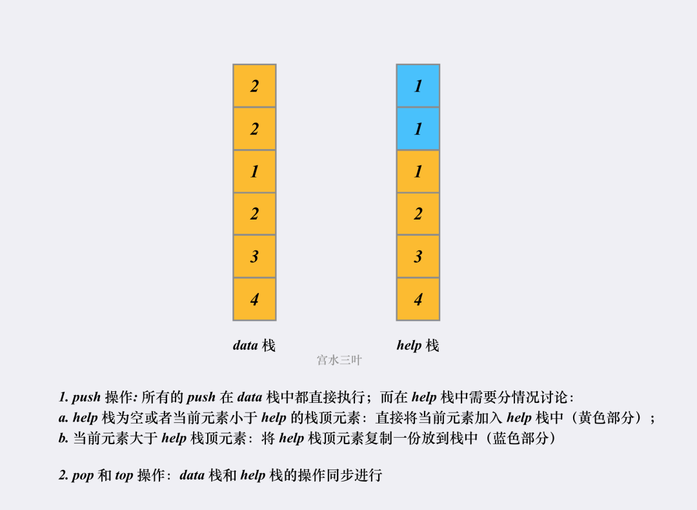

题目：[155. 最小栈](https://leetcode.cn/problems/min-stack/)

## 方法：双栈



```c++
class MinStack {
public:
    stack<int> stk;
    stack<int> help;

    MinStack() {}

    void push(int val) {
        stk.push(val);
        if (help.empty() || val <= help.top()) {
            help.push(val);
        } else {
            help.push(help.top());
        }
    }

    void pop() {
        stk.pop();
        help.pop();
    }

    int top() {
        return stk.top();
    }

    int getMin() {
        return help.top();
    }
};
```

## 方法：一个栈

可以用一个栈，这个栈同时保存的是每个数字 x 进栈的时候的值 与 插入该值后的栈内最小值。即每次新元素 x 入栈的时候保存一个元组：（当前值 x，栈内最小值）。

```c++
class MinStack {
public:
    stack<pair<int, int>> stk;  // [当前值，这个位置下面的最小值]

    MinStack() {}

    void push(int val) {
        if (stk.empty()) {
            stk.push({val, val});
        } else {
            if (val <= stk.top().second) {
                stk.push({val, val});
            } else {
                stk.push({val, stk.top().second});
            }
        }
    }

    void pop() {
        stk.pop();
    }

    int top() {
        return stk.top().first;
    }

    int getMin() {
        return stk.top().second;
    }
};
```