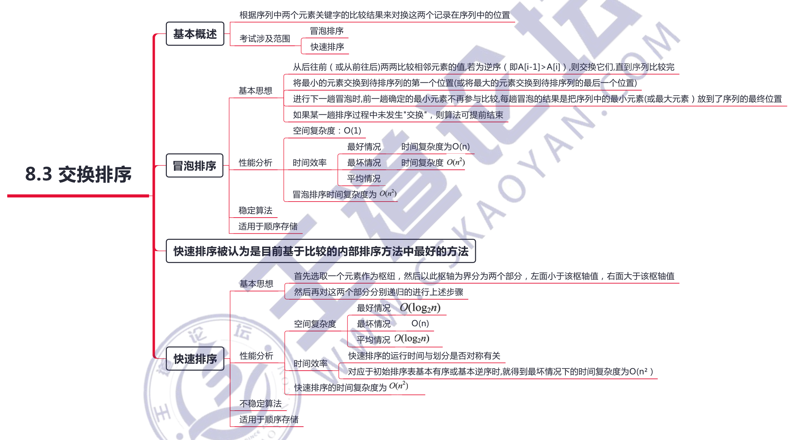
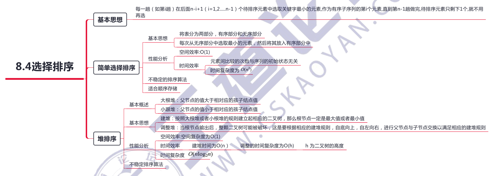
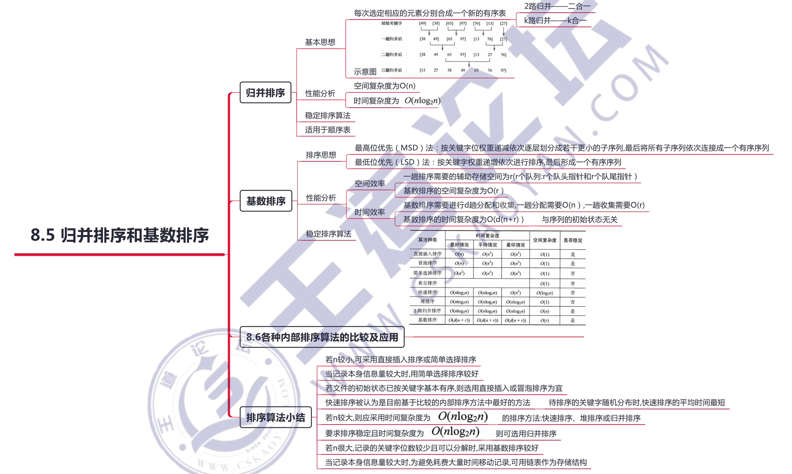
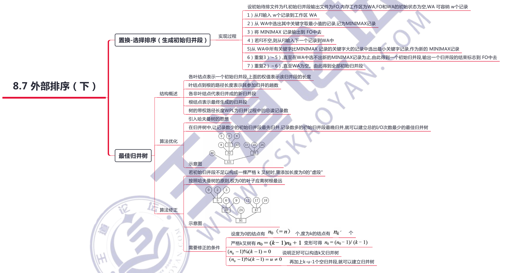

# 排序算法

参考：[https://oi-wiki.org/basic/radix-sort/](https://oi-wiki.org/basic/radix-sort/)

| 算法             | 稳定性           | 平均时间复杂度 | 空间复杂度 |
| ---------------- | ---------------- | -------------- | ---------- |
| 选择排序         | 不稳定           | O(n^2)         | O(1)       |
| 冒泡排序         | 稳定             | O(n^2)         | O(1)       |
| 插入排序         | 稳定             | O(n^2)         | O(1)       |
| 计数排序         | 稳定             | O(n)           | O(n)       |
| 桶排序（重要）   | 取决桶内排序算法 | O(n)           | O(n)       |
| 快速排序（重要） | 不稳定           | O(nlogn)       | O(logn)    |
| 归并排序（重要） | 稳定             | O(nlogn)       | O(n)       |
| 基数排序         | 稳定             | O(n)           | O(n)       |
| 希尔排序         | 不稳定           | O(n^(3/2))     | O(n)       |
| 堆排序           | 不稳定           | O(nlogn)       | O(1)       |
| 锦标赛排序       | 不稳定           | O(nlogn)       | O(n)       |

[稳定性](https://www.cnblogs.com/codingmylife/archive/2012/10/21/2732980.html)：保证排序前2个相等的数其在序列的前后位置顺序和排序后它们两个的前后位置顺序相同。如果Ai = Aj，Ai原来在位置前，排序后Ai还是要在Aj位置前

需要注意的是，算法是否具有稳定性并不能衡量一个算法的优劣，它主要是对算法的性质进行描述。如果待排序表中的关键字不允许重复，则排序结果是唯一的，那么选择排序算法时的稳定与否就无关紧要。

在排序过程中，根据数据元素是否完全在内存中，可将排序算法分为两类：

- 内部排序，是指在排序期间元素全部存放在内存中的排序
- 外部排序，是指在排序期间元素无法全部同时存放在内存中，必须在排序的过程中根据要求不断地在内、外存之间移动的排序。

一般情况下，内部排序算法在执行过程中都要进行两种操作：比较和移动。通过比较两个关键字的大小，确定对应元素的前后关系，然后通过移动元素以达到有序。当然，并非所有的内部排序算法都要基于比较操作，事实上，基数排序就不基于比较。











## 应用

**排序常与「贪心」「二分法」等策略结合**

先排序进行数据预处理，再进行算法计算

## 一、内部排序

### 1、选择排序

基本思想：第一次遍历n-1个数，找到最小的数值与第一个元素交换

第二次遍历n-2个数，找到最小的数值与第二个元素交换…………

**稳定性**：由于 swap（交换两个元素）操作的存在，选择排序是一种不稳定的排序算法

**时间复杂度**：选择排序的最优时间复杂度、平均时间复杂度和最坏时间复杂度均为 `O(n^2)` 

```c++
vector<int> selection_sort(vector<int>& nums){
    for (int i = 0; i < nums.size() - 1; i++) {
        int minIndex = i;
        for (int j = i + 1; j < nums.size(); j++) {
            if (nums[j] < nums[i]) {
                minIndex = j;
            }
        }
        swap(nums[i], nums[minIndex]);
    }
  	return nums;
}
```


### 2、冒泡排序：

基本思想：两个数比较大小，较大的数下沉，较小的数冒起来。

冒泡排序是一种稳定的排序算法

**时间复杂度**：

- 最优情况 `O(n)`，在序列完全有序时，冒泡排序只需遍历一遍数组，不用执行任何交换操作
- 最坏情况 `O(n^2)`，冒泡排序要执行 `(n-1)n/2` 次交换操作
- 平均时间复杂度 `O(n^2)`

```python
def bubble_sort(nums):
	for i in range(0, len(nums)-1):
		for j in range(i+1, len(nums)):
			if nums[i] > nums[j]:
				nums[i], nums[j] = nums[j], nums[i]
	return nums
```

```C++
#include <iostream>
#include <vector>
using namespace std;

int main() {
    vector<int> nums{1, 2, 5, 3, 7, 4, 5, 8};
    for (int i = 0; i < nums.size() - 1; i++) {
        for (int j = i + 1; j < nums.size(); j++) {
            if (nums[i] > nums[j]) {
                swap(nums[i], nums[j]);
            }
        }
    }
    for (int i = 0; i < nums.size(); i++) {
        cout << nums[i] << " ";
    }  // 1 2 3 4 5 5 7 8
    return 0;
}
```

### 3、插入排序

将待排列元素划分为“已排序”和“未排序”两部分，每次从“未排序的”元素中选择一个插入到“已排序的”元素中的正确位置

插入排序是一种稳定的排序算法

**时间复杂度**：

- 最优时间复杂度为 `O(n)`
- 平均和最坏时间复杂度 `O(n^2)`

**算法实现**：

- 数组前面有序（出始0有序，从1往后），不断遍历后面，往前面插入
- 往前面插入时，从前面有序的最后一个（i-1）开始「从后往前比较」

```c++
#include <iostream>
#include <vector>
using namespace std;

int main() {
    vector<int> nums{1, 2, 5, 3, 7, 4, 5, 8};
    for (int i = 1; i < nums.size(); i++) {
        int val = nums[i];
        int j = i - 1;
        while (j >= 0) {
            if (val < nums[j]) {
                nums[j + 1] = nums[j];
                nums[j] = val;
            }
            j--;
        }
    }
    for (int i = 0; i < nums.size(); i++) {
        cout << nums[i] << " ";
    }  // 1 2 3 4 5 5 7 8
    return 0;
}
```

### 4、计数排序

[参考](https://www.cnblogs.com/xiaochuan94/p/11198610.html)

计数排序（英语：Counting sort）是一种线性时间的排序算法该算法于1954年由 Harold H. Seward提出，通过计数将时间复杂度降到了`O(N)`

算法步骤：

1. 找出原数组中元素值最大的，记为`max`。
2. 创建一个新数组`count`，其长度是`max`加1，其元素默认值都为0。
3. 遍历原数组中的元素，以原数组中的「元素值」作为`count`数组的「索引」，以原数组中的元素「出现次数」作为`count`数组的「元素值」
3. 创建结果数组`result`，起始索引`index`。
3. 遍历`count`数组，找出其中元素值大于0的元素，将其对应的索引作为元素值填充到`result`数组中去，每处理一次，`count`中的该元素值减1，直到该元素值不大于0，依次处理`count`中剩下的元素。
3. 返回结果数组`result`。

```
原数组  nums: [2 4 3 1 2 5 9]
计数数组 cnt: [0 1 2 1 1 1 0 0 0 1]
排序完  nums: [1 2 2 3 4 5 9]
```

```c++
#include <iostream>
#include <vector>
using namespace std;

int main() {
    vector<int> nums = {2, 4, 3, 1, 2, 5, 9};
    int maxVal = INT_MIN;
    for (int num : nums) {
        maxVal = max(maxVal, num);
    }

    vector<int> cnt(maxVal + 1, 0); // 数组长度为最大值+1
    for (int num : nums) {
        cnt[num]++;
    }

    int index = 0;
    for (int i = 0; i < cnt.size(); i++) {
        while (cnt[i] > 0) {
            nums[index] = i;
            index++;
            cnt[i]--;
        }
    }

    for (int num : nums) {
        cout << num << " ";
    }
    // 1 2 2 3 4 5 9

    return 0;
}
```

它有一个缺陷，那就是存在空间浪费的问题。比如一组数据`{101,109,108,102,110,107,103}`，其中最大值为110，需要创建一个长度为111的计数数组，前面的`[0,100]`的空间浪费了

优化：将数组长度定为`max-min+1`，即不仅要找出最大值，还要找出最小值，**根据两者的差来确定计数数组的长度，元素要减去最小值再作为新索引，最后取结果时将减去的最小值补上**

```c++
#include <iostream>
#include <vector>
using namespace std;

int main() {
    vector<int> nums = {101, 109, 108, 102, 110, 107, 109};
    int maxVal = INT_MIN;
    int minVal = INT_MAX;
    for (int num : nums) {
        maxVal = max(maxVal, num);
        minVal = min(minVal, num);
    }

    vector<int> cnt(maxVal - minVal + 1, 0);  // 长度为最大值减最小值加1
    for (int num : nums) {
        cnt[num - minVal]++;
    }

    int index = 0;
    for (int i = 0; i < cnt.size(); i++) {
        while (cnt[i] > 0) {
            nums[index] = i + minVal;  // 取结果时将减去的最小值补上
            index++;
            cnt[i]--;
        }
    }

    for (int num : nums) {
        cout << num << " ";
    }
    // 101 102 107 108 109 109 110

    return 0;
}
```

### 5、桶排序（重要）

[参考1](https://blog.csdn.net/qq_27124771/article/details/87651495)，[参考2](https://oi-wiki.org/basic/bucket-sort/)

桶排序（英文：Bucket sort）是排序算法的一种，适用于待排序数据值域较大但分布比较均匀的情况，否则当所有数据集中在同一个桶中时，桶排序失效

「桶排序」是「计数排序」的扩展版本，计数排序可以看成每个桶只存储相同元素，而桶排序每个桶存储一定范围的元素，通过映射函数，将待排序数组中的元素映射到各个对应的桶中，对每个桶中的元素进行排序，最后将非空桶中的元素逐个放入原序列中

一句话总结：**划分多个范围相同的区间，每个子区间自排序，最后合并**


**每个桶的长度**：我们期望将数组中的各个数等距离分配，也就是每个桶的长度相同，也就是对于所有桶来说，桶内最大值减去桶内最小值都是一样的。
$$
每个桶的长度 = max(1, \frac{max(nums)-min(nums)}{len(nums)-1})
$$
**桶的数量**：最后的加一保证了数组的最大值也能分到一个桶。
$$
桶的数量 = \frac{max(nums) - min(nums)}{每个桶的长度} + 1
$$
**每个数对应桶的位置**
$$
idx = \frac{nums[i] - min(nums)}{每个桶的长度}
$$


**算法步骤**

1. 计算最大值与最小值
2. 计算桶的数量
3. 将每个元素放入桶
4. 对每个桶进行排序
5. 将桶中的元素赋值到原序列

**稳定性**

如果使用稳定的内层排序，并且将元素插入桶中时不改变元素间的相对顺序，那么桶排序就是一种稳定的排序算法。

由于每块元素不多，一般使用插入排序。此时桶排序是一种稳定的排序算法。

**时间复杂度**

桶排序的平均时间复杂度为 `O((n+n^2)/(k+k))` （将值域平均分成 n 块 + 排序 + 重新合并元素），当 k约等于n 时为 `O(n)`

桶排序的最坏时间复杂度为`O(n^2)` 

**应用**

桶间隙，可以 `O(n)`的时间复杂度，找到一个无序数组中元素间的[最大间距](https://leetcode-cn.com/problems/maximum-gap/)

元素之间的最大间距一定不会出现在某个桶的内部，而一定会出现在不同桶当中

```c++
#include <algorithm>
#include <iostream>
#include <vector>

using namespace std;
int main() {
    vector<int> nums = {101, 109, 108, 102, 110, 107, 109};
    int n = nums.size();

    // 1 计算最大值与最小值
    int maxVal = *max_element(nums.begin(), nums.end());
    int minVal = *min_element(nums.begin(), nums.end());

    // 2 计算桶的数量
    int bucketSize = max(1, (maxVal - minVal) / (n - 1));  // 1 = max(1, (110-101)/(7-1))
    int bucketNum = (maxVal - minVal) / bucketSize + 1;    // 10 = (110-101) / 1 + 1
    vector<vector<int>> buckets(bucketNum, vector<int>{});

    // 3 将每个元素放入桶
    for (int num : nums) {
        int location = (num - minVal) / bucketSize;
        buckets[location].push_back(num);
    }

    // 4 对每个桶进行排序，注意是引用
    for (auto &b : buckets) {
        sort(b.begin(), b.end());
    }

    // 5 将桶中的元素赋值到原序列
    int index = 0;
    for (auto bucket : buckets) {
        for (int num : bucket) {
            nums[index] = num;
            index++;
        }
    }

    for (int num : nums) {
        cout << num << " ";
    }
    // 101 102 107 108 109 109 110
    return 0;
}
```

### 6、快速排序（重要）

参考一：[快速排序的正确理解方式及运用](https://mp.weixin.qq.com/s/8ZTMhvHJK_He48PpSt_AmQ)

快速排序（英语：Quicksort），又称分区交换排序（英语：partition-exchange sort），简称快排，是一种被广泛运用的排序算法。

工作原理是通过「分治」的方式来将一个数组排序

- 将数列划分为两部分（要求保证相对大小关系）；

- 递归到两个子序列中分别进行快速排序；
  - 从数列中取出一个数作为key值
  - 将比这个数小的数全部放在它的左边，大于或等于它的数全部放在它的右边
  - 递归重复

快速排序是一种不稳定的排序算法

快速排序的最优时间复杂度和平均时间复杂度为 `O(nlogn)`，最坏时间复杂度为 `O(n^2)`

```python
def quick_sort(nums, left, right):
    if left >= right: # 退出递归
        return
    low = left 					# 提前记录递归的左边界
    high = right 				# 提前记录递归的右边届
    key = nums[low] 		# 初始化key值，比key大的放右边，比key小的放左边
    while left < right: # 筛选出本次key值，左边都小，右边都大的数组，跳出时left=right(不懂为啥)
        while left < right and nums[right] > key: # 找到右边比key值小的停下来,因为left位置的值传给key后没用了，先判断右边放到没用的left位置上
            right -= 1
        nums[left] = nums[right] # 把右边错位的值放在array[left]上，看上面left->low->key，所以left这个位置的值已经传给key了，array[left]没用了
        while left < right and nums[left] <= key: # 找到左边比key值大的停下来
            left += 1
        nums[right] = nums[left] # 把左边错位的值放在array[right]上，因为right这个位置上的值已经放到左边了，所以array[right]没用了

    nums[right] = key 	# 此时left=right，所以传到right或left位置都可以

    quick_sort(nums, low, left - 1) 	# left或right都可以
    quick_sort(nums, left + 1, high) 	# left或right都可以

nums = [5,2,9,6,3,7,10,4,1,8,13,54,76,33]
quick_sort(nums,0,len(nums)-1)
print(nums)
```

```c++
void quick_sort(vector<int>& nums, int left, int right){
    if(left >= right){
        return;
    }
    int low = left;
    int high = right;
    int key = nums[low];
    
    while (left < right) {
        while (left < right && nums[right] > key) {
            right--;
        }
        nums[left] = nums[right];
        while (left < right && nums[left] <= key) {
            left++;
        }
        nums[right] = nums[left];
    }
    nums[right] = key;
    quick_sort(nums, low, left-1);
    quick_sort(nums, left+1, high);
}
```

那我就借楼补一个msvc对cpp的sort的实现，大体上就是双轴快排,如果递归过深会转为堆排，如果元素数量小于_ISORT_MAX=32个转插排。注意进入堆排序的判断if (_ISORT_MAX < _Count)要结合前面while里的判断 while (_ISORT_MAX < (_Count = _Last - _First) && 0 < _Ideal)来看。

```c++
//调用形式
_Sort_unchecked(_UFirst, _ULast, _ULast - _UFirst, _Pass_fn(_Pred))
    //定义
    template <class _RanIt,
              class _Pr>
    inline void _Sort_unchecked(_RanIt _First, _RanIt _Last, _Iter_diff_t<_RanIt> _Ideal, _Pr _Pred) {  // order [_First, _Last), using _Pred
    _Iter_diff_t<_RanIt> _Count;
    while (_ISORT_MAX < (_Count = _Last - _First) && 0 < _Ideal) {  // divide and conquer by quicksort
        auto _Mid = _Partition_by_median_guess_unchecked(_First, _Last, _Pred);
        // TRANSITION, VSO#433486
        _Ideal = (_Ideal >> 1) + (_Ideal >> 2);  // allow 1.5 log2(N) divisions

        if (_Mid.first - _First < _Last - _Mid.second) {  // loop on second half
            _Sort_unchecked(_First, _Mid.first, _Ideal, _Pred);
            _First = _Mid.second;
        } else {  // loop on first half
            _Sort_unchecked(_Mid.second, _Last, _Ideal, _Pred);
            _Last = _Mid.first;
        }
    }

    if (_ISORT_MAX < _Count) {  // heap sort if too many divisions
        _Make_heap_unchecked(_First, _Last, _Pred);
        _Sort_heap_unchecked(_First, _Last, _Pred);
    } else if (2 <= _Count) {
        _Insertion_sort_unchecked(_First, _Last, _Pred);  // small
    }
}
```


### 7、归并排序（重要）

参考1：[归并排序的正确理解方式及运用](https://mp.weixin.qq.com/s/7_jsikVCARPFrJ6Hj1EYsg)

参考2：[归并排序](https://oi-wiki.org/basic/merge-sort/)

#### 1）性质

归并排序是一种稳定的排序算法

归并排序的最优时间复杂度、平均时间复杂度和最坏时间复杂度均为 O(nlogn)

空间复杂度为 O(n)

#### 2）算法思路

所有「递归」的算法，本质上都是在遍历一棵（递归）树，然后在节点（前中后序位置）上执行代码

要写递归算法，本质上就是要告诉每个节点需要做什么

**归并排序分为三个步骤**

- 将数列划分为两部分；
- 递归地分别对两个子序列进行归并排序
- 合并两个子序列

> 不难发现，归并排序的前两步都很好实现，关键是「如何合并两个子序列」
>
> 注意到两个子序列在第二步中已经保证了都是有序的了，第三步中实际上是想要把两个 **有序** 的序列合并起来

**归并排序的代码框架**

```c++
// 定义：排序 nums[lo..hi]
void sort(int[] nums, int lo, int hi) {
    if (lo == hi) {
        return;
    }
    int mid = (lo + hi) / 2;
    sort(nums, lo, mid); // 利用定义，排序 nums[lo..mid]
    sort(nums, mid + 1, hi); // 利用定义，排序 nums[mid+1..hi]

    /****** 后序位置 ******/
    // 此时两部分子数组已经被排好序
    // 合并两个有序数组，使 nums[lo..hi] 有序
    merge(nums, lo, mid, hi);
    /*********************/
}

// 将有序数组 nums[lo..mid] 和有序数组 nums[mid+1..hi]
// 合并为有序数组 nums[lo..hi]
void merge(int[] nums, int lo, int mid, int hi);
```

上述框架印证了并归排序的经典的总结：归并排序就是先把左半边数组排好序，再把右半边数组排好序，然后把两半数组合并

观察下二叉树的后序遍历和求二叉树的最大深度的代码，会发现并归排序的框架就是后序遍历的框架

```c++
/* 二叉树后序遍历*/
void traverse(TreeNode root) {
    if (root == null) {
        return;
    }
    traverse(root.left);
    traverse(root.right);
    /****** 后序位置 ******/
    print(root.val);
    /*********************/
}

// 定义：输入根节点，返回这棵二叉树的最大深度
int maxDepth(TreeNode root) {
    if (root == null) {
        return 0;
    }
    // 利用定义，计算左右子树的最大深度
    int leftMax = maxDepth(root.left);
    int rightMax = maxDepth(root.right);
    // 整棵树的最大深度等于左右子树的最大深度取最大值，
    // 然后再加上根节点自己
    int res = Math.max(leftMax, rightMax) + 1;

    return res;
}
```

归并排序的过程可以在逻辑上抽象成一棵「二叉树」，树上的每个节点的值可以认为是 `nums[lo..hi]`，叶子节点的值就是数组中的单个元素


然后，在每个节点的后序位置（左右子节点已经被排好序）的时候执行`merge`函数，合并两个子节点上的子数组


这个`merge`操作会在二叉树的每个节点上都执行一遍，执行顺序是二叉树后序遍历的顺序

我们把`nums[lo..hi]`理解成二叉树的节点，`srot`函数理解成二叉树的遍历函数，整个归并排序的执行过程就是以下 GIF 描述的这样：


#### 4）代码实现

《算法 4》中给出的归并排序代码兼具了简洁和高效的特点，以此作为归并算法模板

```c++
#include <iostream>
#include <vector>

using namespace std;

class MergeSort {
private:
    vector<int> tmp;  // 用于辅助合并有序数组
    void _sort(vector<int> &nums, int lo, int hi) {
        if (lo == hi) return;  // 单个元素不用排序
        int mid = lo + (hi - lo) / 2;
        _sort(nums, lo, mid);      // 先对左半部分数组 [lo,mid] 排序
        _sort(nums, mid + 1, hi);  // 再对右半部分数组 [mid+1,hi] 排序
        merge(nums, lo, mid, hi);  // 将两部分有序数组合并成一个有序数组
    }
    void merge(vector<int> &nums, int lo, int mid, int hi) {
        // 先把 [lo, hi] 复制到辅助数组中，以便合并后的结果能够直接存入 nums
        for (int i = lo; i <= hi; i++) tmp[i] = nums[i];

        // 双指针，分别指向左右两个有序数组，合并
        int ptr_l = lo, ptr_r = mid + 1;
        for (int idx = lo; idx <= hi; idx++) {
            if (ptr_l == mid + 1) {  // 左半边数组已全部被合并
                nums[idx] = tmp[ptr_r++];
            } else if (ptr_r == hi + 1) {  // 右半边数组已全部被合并
                nums[idx] = tmp[ptr_l++];
            } else if (tmp[ptr_l] < tmp[ptr_r]) {
                nums[idx] = tmp[ptr_l];
                ptr_l++;
            } else if (tmp[ptr_l] == tmp[ptr_r]) {
                nums[idx] = tmp[ptr_l];  // 注意：两个指针相等时，在单纯排序时，哪个指针移动无所谓
                ptr_l++;                 // 但是在求逆序对时，一定是左指针移动
            } else if (tmp[ptr_l] > tmp[ptr_r]) {
                // reverse_pairs += mid - ptr_l + 1; // 逆序对进行累加
                nums[idx] = tmp[ptr_r];
                ptr_r++;
            }
        }
    }

public:
    void sort(vector<int> &nums) {
        int n = nums.size();
        tmp.resize(n);          // 先给辅助数组开辟内存空间，不要放在递归里面
        _sort(nums, 0, n - 1);  // 排序整个数组（原地修改）
    }
};

int main() {
    vector<int> nums = {5, 4, 7, 6, 3, 2, 1};
    MergeSort m;
    m.sort(nums);

    for (int a : nums) cout << a << " ";
    cout << endl;  // 1 2 3 4 5 6 7
    return 0;
}
```

归并排序的时间复杂度：集中在`merge`函数中把 [lo, hi] 复制到辅助数组中这一步，但每次`merge`输入的`lo`和`hi`都不同，所以不容易直观地看出时间复杂度。

观察二叉树每一层的结点，在同一层的许多 merge 函数合计的次数为 n 次

同时，二叉树的高度为 logn

因此时间复杂度为 `O(nlogn)`

#### 5）应用（例题）

并归排序经典的应用是：排序链表和计算逆序对

[148. 排序链表](https://leetcode-cn.com/problems/sort-list/)

[剑指 Offer 51. 数组中的逆序对](https://leetcode-cn.com/problems/shu-zu-zhong-de-ni-xu-dui-lcof/)

## 二、外部排序

