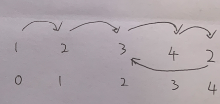

[287. 寻找重复数](https://leetcode-cn.com/problems/find-the-duplicate-number/)

## 方法：快慢双指针+环入口

### 本题的难点是如何将输入的数组看作为链表

先明确前提，整数的数组 `nums` 中的数字范围是 `[1,n]`。考虑一下两种情况：

情况一：如果数组中没有重复的数，以数组 `[1,3,4,2]`为例，我们将数组下标 `n` 和数 `nums[n]` 建立映射关系

我们从下标为 0 出发，根据映射关系计算出一个值，以这个值为新的下标，再用这个映射关系计算，以此类推，直到下标超界。

这样可以产生一个类似链表一样的序列 `0->1->3->2->4->null`


情况二：如果数组中有重复的数，以数组 `[1,2,3,4,2]` 为例,我们将数组下标 `n` 和数 `nums[n]` 建立映射关系

我们从下标为 0 出发，根据映射关系，以此类推产生一个类似链表一样的序列

`0->1->2->3->4->2->3->4->2...`，产生了环 `3->4->2`



从理论上讲，数组中如果有重复的数，那么就会产生「多对一的映射」，这样，形成的链表就一定会有环路了


因此这个问题转化为，寻找环入口

时间复杂度：O(n)  空间复杂度：O(1)

```c++
class Solution {
public:
    int findDuplicate(vector<int>& nums) {
        int n = nums.size();
        int slow = 0;
        int fast = 0;
        while (true) {
            slow = nums[slow];
            fast = nums[nums[fast]];
            if (slow == fast) break;
        }
        fast = 0;
        while (nums[slow] != nums[fast]) {
            slow = nums[slow];
            fast = nums[fast];
        }
        return nums[slow];
    }
};
```

