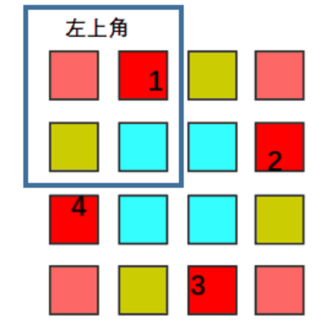
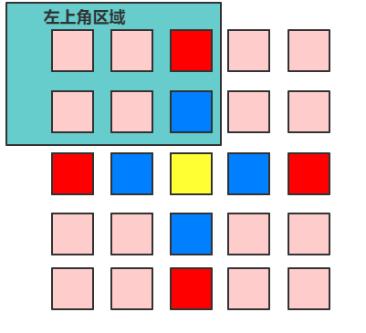

题目：[面试题 01.07. 旋转矩阵](https://leetcode.cn/problems/rotate-matrix-lcci/)

题解：https://leetcode.cn/problems/rotate-matrix-lcci/solution/c-tu-jie-yuan-di-cao-zuo-ji-bai-shuang-bai-vv-by-t/

整个矩阵的旋转可以理解为 **起点都在左上角区域，然后依次顺时针移动**，如下图示：



而相隔的两个位置是中心对称的，基于此可以计算出发生交换的四个元素 位置关系。

设四个位置中，位于 左上角区域 的位置坐标为 (i,j)，

则按顺时针顺序，四个位置分别为(i,j), (j, n-i-1), (n-i-1,n-j-1), (n-j-1,i)。

其中 n 为 matrix.size(), i, j 分别为matrix的行列下标，从 0 开始。

整个矩阵的旋转可以理解为 起点都在左上角区域，然后依次顺时针移动，如下图示：

matrix.size() 为奇数时，位置的对应关系相同，但左上角区域并 **不是整个矩阵的四分之一**，如下图示：



其实就是多了中间列的上半部分。

那么现在捋一下如何 原地操作元素：

枚举左上区域的所有位置，然后通过上面总结的位置关系直接交换元素。

对于一个位置 (i,j)，需要 交换三次：

- `swap(matrix[i][j], matrix[j][n-i-1]);`
- `swap(matrix[i][j], matrix[n-i-1][n-j-1]);`
- `swap(matrix[i][j], matrix[n-j-1][i]);`

综上，整个过程的时间复杂度为 O(n^2)；空间复杂度为 (1)。

```c++
class Solution {
public:
    void rotate(vector<vector<int>>& matrix) {
        int n = matrix.size();
        if(n == 0) { return; }
        int r = (n>>1)-1; //左上角区域的最大行下标，
        int c = (n-1)>>1; //左上角区域的最大列下标，行列下标从 0 开始。
        for(int i = r; i >= 0; --i) {
            for(int j = c; j >= 0; --j) {
                swap(matrix[i][j], matrix[j][n-i-1]);
                swap(matrix[i][j], matrix[n-i-1][n-j-1]);
                swap(matrix[i][j], matrix[n-j-1][i]);
            }
        }
    }
};
```

