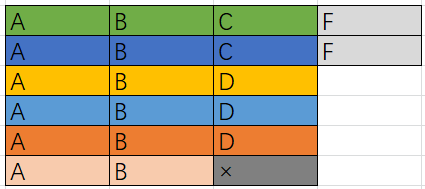

[621. 任务调度器](https://leetcode-cn.com/problems/task-scheduler/)

题解来源：https://leetcode-cn.com/problems/task-scheduler/solution/tong-zi-by-popopop/



需要检查两个方案：

**方案一**：

- 记录最大任务数量 m（A的数量）
- 任务数量最多的任务的种类数量（如A、B），也就是最后一个桶子的任务数 x，
- 长方形的长为 n+1

```
方案一耗时：opt_1 = (m-1)*(n+1) + x
```

但是此方案，会有剩余的情况，如格子都填满后还有剩余的任务，这些任务会往第一行的后面继续加

**方案二**：

- 统计出所有的任务数量

```
方案二耗时：opt_2 = tasks.size()
```

方案二会将方案一中剩余的情况，修复

**总方案**：

- 当格子有没填满时，方案一耗时「大于」方案二耗时
- 当格子都填满，还有剩余的任务时，方案一耗时「小于」方案二耗时

```
max(opt_1, opt_2)
```

时间复杂度：`O(n)`，这里没有将种类数26作为常数去计算

空间复杂度：`O(n)`

```c++
class Solution {
public:
    int leastInterval(vector<char>& tasks, int n) {
        unordered_map<char, int> counter;
        for (char task : tasks) counter[task]++;
        int m = 0;  // 最大任务数量
        int x = 0;  // 任务数量最多的任务的种类数量
        for (auto& [k, v] : counter) {
            if (v > m) {
                m = v;
                x = 1;
            } else if (v == m) {
                x++;
            }
        }
        int opt_1 = (m - 1) * (n + 1) + x;
        int opt_2 = tasks.size();
        return max(opt_1, opt_2);
    }
};
```

