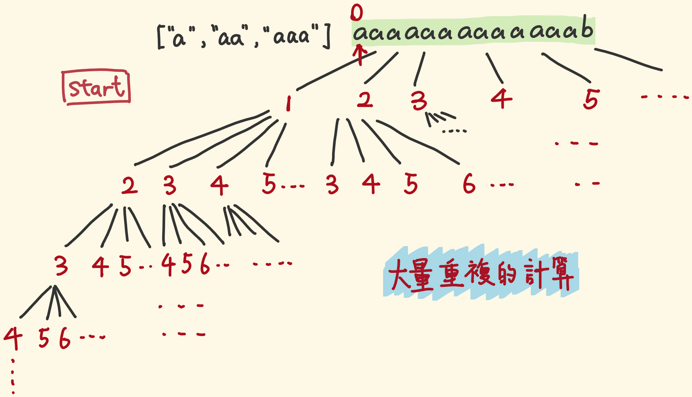
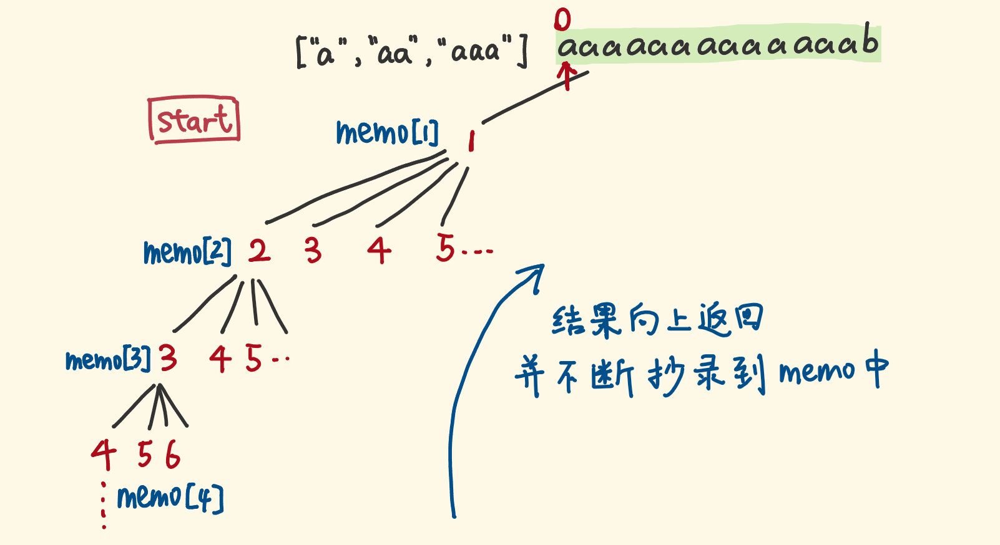

[139. 单词拆分](https://leetcode-cn.com/problems/word-break/)

参考一：https://leetcode-cn.com/problems/word-break/solution/shou-hui-tu-jie-san-chong-fang-fa-dfs-bfs-dong-tai/

参考二：https://leetcode-cn.com/problems/word-break/solution/139-dan-ci-chai-fen-hui-su-fa-wan-quan-b-0zwf/

## 方法一：回溯法dfs（超时）

用 DFS 回溯，考察所有的拆分可能，指针从左往右扫描：

- 如果指针的左侧部分是单词，则对剩余子串递归考察。

- 如果指针的左侧部分不是单词，不用看了，回溯，考察别的分支。


时间复杂度：O(2^n)，因为每一个单词都有两个状态，切割和不切割

空间复杂度：O(n)，算法递归系统调用栈的空间

```c++
class Solution {
public:
    bool wordBreak(string s, vector<string>& wordDict) {
        unordered_set<string> us(wordDict.begin(), wordDict.end());
        return dfs(0, s, us);
    }
    bool dfs(int start, string &s, unordered_set<string> &us) {
        if (start == s.size()) {
            return true;
        }
        for (int i = start; i < s.size(); i++) {
            string word = s.substr(start, i - start + 1);
            if (us.count(word) == 1) {
                if (dfs(i+1, s, us)) return true;
            }
        }
        return false;
    }
};
```

## 方法二：记忆化dfs

下面这个例子中，start 指针代表了节点的状态，可以看到，做了大量重复计算：



**用一个数组，存储计算的结果，数组索引为指针位置，值为计算的结果。代表「以 idx 开头」的子串满足条件**

下次遇到相同的子问题，直接返回命中的缓存值，就不用调重复的递归。



时间复杂度其实也是：O(2^n)。只不过对于上面那个超时测试用例优化效果特别明显。

```c++
class Solution {
public:
    bool wordBreak(string s, vector<string> &wordDict) {
        unordered_set<string> us(wordDict.begin(), wordDict.end());
        vector<int> memory(s.size(), -1);  // 初始状态为-1，代表没来过
        return dfs(0, memory, s, us);
    }
    bool dfs(int start, vector<int> &memory, string &s, unordered_set<string> &us) {
        if (start == s.size()) {
            return true;
        }
        if (memory[start] != -1) {  // 之前来过，返回之前的值
            return memory[start];   // 1满足，0不满足
        }
        for (int i = start; i < s.size(); i++) {
            string word = s.substr(start, i - start + 1);
            if (us.count(word) == 1) {
                if (dfs(i + 1, memory, s, us)) {
                    memory[start] = 1;  // 记录以 start 开头的子串满足
                    return true;
                }
            }
        }
        memory[start] = 0;  // 记录以 start 开头的子串不满足
        return false;
    }
};
```

## 方法三：bfs

bfs也可以做，可看看参考链接

## 方法四：完全背包-dp

单词就是物品，字符串s就是背包，单词能否组成字符串s，就是问物品能不能把背包装满。拆分时可以重复使用字典中的单词，说明就是一个完全背包！

将大问题分解为规模小一点的子问题：

- 前 i 个字符的子串，能否分解成单词
- 剩余子串，是否为单个单词

dp[i] 代表：长度为 i 的 s[0:i] 子串是否能拆分成单词。或者说以 i-1 结尾的子串能否拆分成单词

所以题目求：dp[s.length]


**如果前面的 j-1 个ok，截取的word（从 j 到 i-1）也在，那得出前面 i-1 个ok，dp[i] = true**


时间复杂度：`O(n^3)`，因为substr返回子串的副本是O(n)的复杂度（这里的n是substring的长度）

空间复杂度：`O(n)`

```c++
class Solution {
public:
    bool wordBreak(string s, vector<string>& wordDict) {
        unordered_set<string> us(wordDict.begin(), wordDict.end());
        vector<bool> dp(s.length() + 1, false);
        dp[0] = true;
        for (int i = 1; i <= s.length(); i++) {      // 遍历背包
            for (int j = 0; j < i; j++) {            // 遍历物品
                string word = s.substr(j, i - j);    // substr(起始位置，截取的个数)
                if (dp[j] && us.count(word) == 1) {  // 
                    dp[i] = true;
                }
            }
        }
        return dp[s.length()];
    }
};
```

## 
