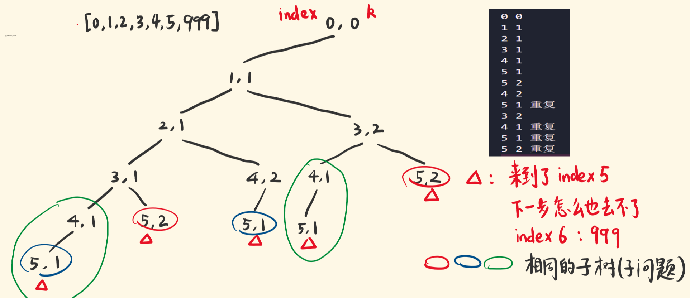

[403. 青蛙过河](https://leetcode-cn.com/problems/frog-jump/)

## 方法一：普通dfs（超时）

注意：刚开始时，k 为 0

画出递归树，可看出有重复的「子问题」



```c++
class Solution {
public:
    int n;
    unordered_map<int, int> position; // 石头编号:该石头位于stones的下标

    // cur为stones数组下标
    bool dfs(int cur, int k, vector<int>& stones) {
        if (cur == n - 1) return true;  // 到达终点

        for (int d = -1; d <= 1; d++) {
            // next_st_idx下个石头编号
            int next_st_idx = stones[cur] + k + d;
            if (next_st_idx == stones[cur]) continue;  // 原地踏步
            if (position.count(next_st_idx)) {         // 如果这个石头存在（剪枝）
                bool res = dfs(position[next_st_idx], k + d, stones);
                if (res) {
                    return true;
                }
            }
        }
        return false;
    }

    bool canCross(vector<int>& stones) {
        n = stones.size();
        for (int i = 0; i < n; i++) {
            position[stones[i]] = i;
        }
        return dfs(0, 0, stones);
    }
};
```

## 方法二：记忆化dfs

记忆化dfs的难点在于：**记忆是为了什么（目的），为了该目的需要记忆什么**

记忆是为了下次遇见该「子问题」能够直接取到结果，因此需要记忆「子问题」

通常可以用该点的下标来描述一个「子问题」，但是**这道题的「子问题」需要用该点的下标和这个点怎么来的（k值）两个维度共同描述**

> 例如 cur=5,k=3 和 cur=5,k=2 是两个不同的子问题

那么就需要用「哈希函数」去描述这个子问题，同时确保不发生「哈希碰撞」

```c++
class Solution {
public:
    int n;
    unordered_map<int, int> position;  // 石头编号:该石头位于stones的下标
    unordered_set<int> memo;           // 记录已走过的点

    // cur为stones数组下标
    bool dfs(int cur, int k, vector<int>& stones) {
        if (cur == n - 1) return true;  // 到达终点
        int key = cur * 1000 + k;       // 哈希函数
        if (memo.count(key) == 0) {
            memo.insert(key);  // 没来过，记录下
        } else {
            // 第二次遇见，说明第一次到这个点的时候没到达结尾而没中断
            // 再次遇见了，肯定也不会到达终点
            return false;
        }

        for (int d = -1; d <= 1; d++) {
            // next_st_idx下个石头编号
            int next_st_idx = stones[cur] + k + d;
            if (next_st_idx == stones[cur]) continue;  // 原地踏步
            if (position.count(next_st_idx)) {         // 如果这个石头存在
                bool res = dfs(position[next_st_idx], k + d, stones);
                if (res) {
                    return true;
                }
            }
        }
        return false;
    }

    bool canCross(vector<int>& stones) {
        n = stones.size();
        for (int i = 0; i < n; i++) {
            position[stones[i]] = i;
        }
        return dfs(0, 0, stones);
    }
};
```

