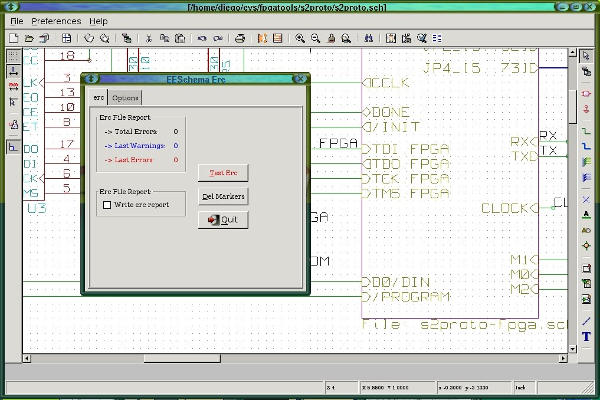
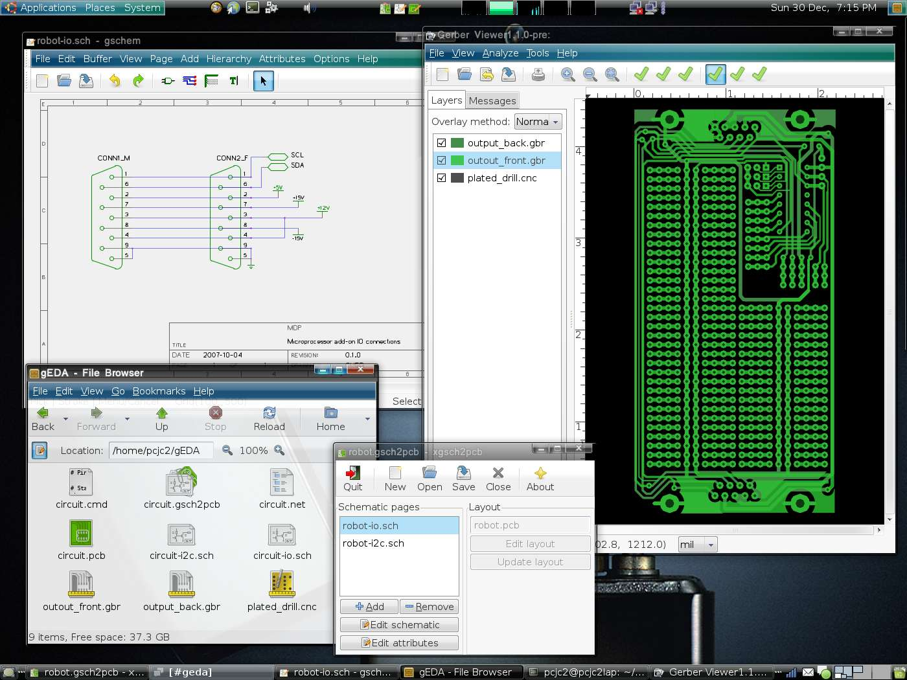

# 电子设计自动化

**电子设计自动化**（英语：**Electronic design automation**，缩写：**EDA**）是指利用计算机辅助设计（CAD）软件，来完成**超大规模集成电路（VLSI）芯片的功能设计、综合、验证、物理设计**（包括布局、布线、版图、设计规则检查）等流程的设计方式。

## 一、发展

### 历史

1、在电子设计自动化出现之前，**设计人员必须「手工」完成集成电路的设计、布线等工作**，这是因为当时所谓集成电路的复杂程度远不及现在。工业界开始使用几何学方法来制造用于电路光绘（photoplotter）的胶带。到了1970年代中期，开发人应尝试将整个设计过程自动化，而不仅仅满足于自动完成掩膜草图。第一个电路[布局](https://baike.baidu.com/item/布局)、[布线](https://baike.baidu.com/item/布线)工具研发成功。设计自动化研讨会（Design Automation Conference）在这一时期被创立，旨在促进电子设计自动化的发展。

2、电子设计自动化发展的下一个重要阶段以卡弗尔·米德（Carver Mead）和[琳·康维](https://baike.baidu.com/item/琳·康维)于1980年发表的论文《[超大规模集成电路系统导论](https://baike.baidu.com/item/超大规模集成电路系统导论/51096927)》（*Introduction to VLSI Systems*）为标志。这一篇具有重大意义的论文提出了通过[编程语言](https://baike.baidu.com/item/编程语言)来进行芯片设计的新思想。如果这一想法得到实现，芯片设计的复杂程度可以得到显著提升。这主要得益于用来进行集成电路[逻辑仿真](https://baike.baidu.com/item/逻辑仿真)、[功能验证](https://baike.baidu.com/item/功能验证)的工具的性能得到相当的改善。随着计算机仿真技术的发展，设计项目可以在构建实际硬件电路之前进行[仿真](https://baike.baidu.com/item/仿真)，芯片[布局](https://baike.baidu.com/item/布局)、[布线](https://baike.baidu.com/item/布线/1516927)对人工设计的要求降低，而且软件错误率不断降低。直至今日，尽管所用的语言和工具仍然不断在发展，但是通过编程语言来设计、验证电路预期行为，利用工具软件综合得到低抽象级（或称“后端”）[物理设计](https://baike.baidu.com/item/物理设计/12728832)的这种途径，仍然是数字集成电路设计的基础。

3、从1981年开始，电子设计自动化逐渐开始商业化。1984年的设计自动化会议（Design Automation Conference）上还举办了第一个以电子设计自动化为主题的销售展览。Gateway设计自动化在1986年推出了一种[硬件描述语言](https://baike.baidu.com/item/硬件描述语言)[Verilog](https://baike.baidu.com/item/Verilog)，这种语言在现在是最流行的高级抽象设计语言。1987年，在[美国国防部](https://baike.baidu.com/item/美国国防部)的资助下，另一种硬件描述语言VHDL被创造出来。现代的电子设计自动化设计工具可以识别、读取不同类型的硬件描述。根据这些语言规范产生的各种仿真系统迅速被推出，使得设计人员可对设计的芯片进行直接仿真。后来，技术的发展更侧重于[逻辑综合](https://baike.baidu.com/item/逻辑综合)。

[数字集成电路](https://baike.baidu.com/item/数字集成电路/6931724)的设计都比较模块化（参见[集成电路设计](https://baike.baidu.com/item/集成电路设计)、[设计收敛](https://baike.baidu.com/item/设计收敛)（Design closure）和设计流（Design flow (EDA)））。半导体器件制造工艺需要标准化的设计描述，高抽象级的描述将被编译为信息单元（cell）的形式。设计人员在进行逻辑设计时尚无需考虑信息单元的具体硬件工艺。利用特定的集成电路制造工艺来实现硬件电路，信息单元就会实施预定义的逻辑或其他电子功能。半导体硬件厂商大多会为它们制造的元件提供“元件库”，并提供相应的标准化仿真模型。相比数字的电子设计自动化工具，[模拟系统](https://baike.baidu.com/item/模拟系统)的电子设计自动化工具大多并非模块化的，这是因为模拟电路的功能更加复杂，而且不同部分的相互影响较强，而且作用规律复杂，电子元件大多没有那么理想。Verilog AMS就是一种用于模拟电子设计的硬件描述语言。此文，设计人员可以使用[硬件验证语言](https://baike.baidu.com/item/硬件验证语言)来完成项目的验证工作最新的发展趋势是将集描述语言、验证语言集成为一体，典型的例子有[SystemVerilog](https://baike.baidu.com/item/SystemVerilog)。

随着集成电路规模的扩大、半导体技术的发展，电子设计自动化的重要性急剧增加。这些工具的使用者包括半导体器件制造中心的硬件技术人员，他们的工作是操作半导体器件制造设备并管理整个工作车间。一些以设计为主要业务的公司，也会使用电子设计自动化软件来评估制造部门是否能够适应新的设计任务。电子设计自动化工具还被用来将设计的功能导入到类似[现场可编程逻辑门阵列](https://baike.baidu.com/item/现场可编程逻辑门阵列)的半定制[可编程逻辑器件](https://baike.baidu.com/item/可编程逻辑器件)，或者生产[全定制](https://baike.baidu.com/item/全定制)的[专用集成电路](https://baike.baidu.com/item/专用集成电路)。

### 现况

现今数字电路非常模组化（参见[集成电路设计](https://baike.baidu.com/item/集成电路设计/2090026)、[设计收敛](https://baike.baidu.com/item/设计收敛)、设计流程 (EDA)），产线最前端将设计流程标准化，把设计流程区分为许多“细胞”（cells），而暂不考虑技术，接着细胞则以特定的集成电路技术实现逻辑或其他电子功能。制造商通常会提供组件库（libraries of components），以及符合标准模拟工具的模拟模型给生产流程。模拟 EDA 工具较不模组化，因为它需要更多的功能，零件间需要更多的互动，而零件一般说较不理想。

在电子产业中，由于半导体产业的规模日益扩大，EDA 扮演越来越重要的角色。使用这项技术的厂商多是从事半导体器件制造的[代工](https://baike.baidu.com/item/代工)制造商，以及使用 EDA 模拟软件以评估生产情况的设计服务公司。EDA 工具也应用在[现场可编程逻辑门阵列](https://baike.baidu.com/item/现场可编程逻辑门阵列)的程序设计上。

2019年，我国EDA市场规模约为5.8亿美元，仅占全球市场的5.6%。中国EDA厂商总营收不到4.2亿元，只占全球市场份额的0.6%。 [3] 

## 二、EDA 软件聚焦点

### 1、设计

主条目：[设计流程（EDA）](https://en.wiki.hancel.org/wiki/Design_flow_(EDA))

设计流程主要通过几个主要组件来表征；这些包括：

- [高级综合](https://en.wiki.hancel.org/wiki/High-level_synthesis)（也称为行为综合或算法综合）——高级设计描述（例如在 C/C++ 中）被转换为[RTL](https://en.wiki.hancel.org/wiki/Register-transfer_level)或寄存器传输级别，负责通过利用寄存器之间的交互来表示电路。
- [逻辑综合](https://en.wiki.hancel.org/wiki/Logic_synthesis)——将[RTL](https://en.wiki.hancel.org/wiki/Register-transfer_level)设计描述（例如用 Verilog 或 VHDL 编写）翻译成离散的[网表](https://en.wiki.hancel.org/wiki/Netlist)或逻辑门的表示。
- [原理图捕获](https://en.wiki.hancel.org/wiki/Schematic_capture)——用于标准单元数字、模拟、类 RF 捕获 Orcad 中的 CIS，由 Cadence 和 Proteus 中的 ISIS。[*[需要澄清](https://en.wiki.hancel.org/wiki/Wikipedia:Please_clarify)*]
- [布局](https://en.wiki.hancel.org/wiki/Placement_(EDA))- 通常是[原理图驱动的布局](https://en.wiki.hancel.org/wiki/Schematic-driven_layout)，例如 Cadence 的 Orcad 中的 Layout，Proteus 中的 ARES

### 2、模拟

主条目：[电子电路仿真](https://en.wiki.hancel.org/wiki/Electronic_circuit_simulation)

- [晶体管模拟](https://en.wiki.hancel.org/wiki/SPICE)——原理图/布局行为的低级晶体管模拟，在器件级精确。
- [逻辑仿真](https://en.wiki.hancel.org/wiki/Logic_simulation)[——RTL](https://en.wiki.hancel.org/wiki/Register-transfer_level)或门网表的数字（[布尔](https://en.wiki.hancel.org/wiki/Boolean_algebra)0/1）行为的数字仿真，在布尔级精确。
- 行为仿真——设计架构操作的高级仿真，在周期级或接口级准确。
- [硬件仿真](https://en.wiki.hancel.org/wiki/Hardware_emulation)——使用专用硬件来仿真所提议设计的逻辑。有时可以插入系统代替尚未构建的芯片；这称为**在线仿真**。
- [技术 CAD](https://en.wiki.hancel.org/wiki/Technology_CAD)模拟和分析底层工艺技术。器件的电气特性直接来自器件物理特性。
- [电磁场求解器](https://en.wiki.hancel.org/wiki/Electromagnetic_field_solver)，或只是[场求解器](https://en.wiki.hancel.org/wiki/Electromagnetic_field_solver)，直接求解麦克斯韦方程组，用于 IC 和 PCB 设计中感兴趣的案例。它们以比上面的[布局提取](https://en.wiki.hancel.org/wiki/Layout_extraction)更慢但更准确而闻名。

### 3、分析与验证

- [功能验证](https://en.wiki.hancel.org/wiki/Functional_verification)
- [时钟域交叉验证](https://en.wiki.hancel.org/wiki/Clock_domain_crossing)（CDC 检查）：类似于[linting](https://en.wiki.hancel.org/wiki/Lint_programming_tool)，但这些检查/工具专门用于检测和报告潜在问题，如[数据丢失](https://en.wiki.hancel.org/wiki/Data_loss)、由于在设计中使用多个[时钟域而导致](https://en.wiki.hancel.org/wiki/Clock_domain)[的亚稳定性](https://en.wiki.hancel.org/wiki/Metastability_in_electronics)。
- [形式验证](https://en.wiki.hancel.org/wiki/Formal_verification)，也就是[模型检查](https://en.wiki.hancel.org/wiki/Model_checking)：试图通过数学方法证明系统具有某些期望的属性，并且某些不希望的影响（例如[死锁](https://en.wiki.hancel.org/wiki/Deadlock)）不会发生。
- [等效性检查：芯片的](https://en.wiki.hancel.org/wiki/Formal_equivalence_checking)[RTL](https://en.wiki.hancel.org/wiki/RTLinux)描述和综合[网表](https://en.wiki.hancel.org/wiki/Netlist)之间的算法比较，以确保*逻辑*级别的功能等效性。
- [静态时序分析](https://en.wiki.hancel.org/wiki/Static_timing_analysis)：以与输入无关的方式分析电路的时序，从而找到所有可能输入的最坏情况。
- [物理验证](https://en.wiki.hancel.org/wiki/Physical_verification)，PV：检查设计是否可以物理制造，并且最终的芯片不会有任何功能预防物理缺陷，并且符合原始规格。

### 4、制造准备

- 掩模数据准备或 MDP - 实际光刻掩模的生成，用于物理制造芯片。
  - *芯片精加工*，包括定制名称和结构，以提高布局的可[制造](https://en.wiki.hancel.org/wiki/Design_for_manufacturability_(IC))性。后者的例子是密封环和填料结构。[[4\]](https://en.wiki.hancel.org/wiki/Electronic_design_automation#cite_note-Layout-4)
  - 生成带有测试图案和对准标记的*标线布局。*
  - *Layout-to-mask 准备*，通过图形操作增强版图数据，例如[分辨率增强技术](https://en.wiki.hancel.org/wiki/Resolution_enhancement_techniques)或 RET——用于提高最终[光掩模](https://en.wiki.hancel.org/wiki/Photomask)质量的方法。这还包括[光学邻近校正](https://en.wiki.hancel.org/wiki/Optical_proximity_correction)或 OPC——在使用此掩模制造芯片时，对稍后发生的[衍射](https://en.wiki.hancel.org/wiki/Diffraction)和[干涉](https://en.wiki.hancel.org/wiki/Interference_(wave_propagation))效应进行前期补偿。
  - *[掩码生成](https://en.wiki.hancel.org/wiki/Mask_generation)*——从分层设计中生成平面掩码图像。
  - *[自动测试模式生成](https://en.wiki.hancel.org/wiki/Automatic_test_pattern_generation)*或 ATPG – 系统地生成模式数据以执行尽可能多的逻辑门和其他组件。
  - *[内置自测](https://en.wiki.hancel.org/wiki/Built-in_self-test)*或 BIST – 安装独立的测试控制器以自动测试设计中的逻辑或存储器结构

### 5、功能安全

- [功能安全分析](https://en.wiki.hancel.org/w/index.php?title=Functional_safety_analysis&action=edit&redlink=1)、及时故障 (FIT) 率的系统计算和设计的诊断覆盖率指标，以满足所需安全完整性级别的合规性要求。
- [功能安全综合](https://en.wiki.hancel.org/w/index.php?title=Functional_Safety_Synthesis&action=edit&redlink=1)，为结构化元素（模块、RAM、ROM、寄存器文件、FIFO）添加可靠性增强，以提高故障检测/容错能力。这些包括（不限于），添加错误检测和/或纠正代码（汉明），用于故障检测和容错的冗余逻辑（重复/三次）和协议检查（接口奇偶校验、地址对齐、节拍计数）
- [功能安全验证](https://en.wiki.hancel.org/w/index.php?title=Functional_Safety_Verification&action=edit&redlink=1)，故障活动的运行，包括将故障插入设计和验证安全机制以适当的方式对被认为涵盖的故障作出反应。

---

原理图捕捉程序：

用于连接器设计的 PCB 布局和原理图：

## 三、社会意义

EDA被誉为“芯片之母”，是电子设计的基石产业。拥有百亿美金的EDA市场构筑了整个电子产业的根基，可以说“谁掌握了EDA，谁就有了芯片领域的主导权。

”近年来，我国在多个领域面临关键核心技术“卡脖子”的危机，其中对芯片技术领域的制约尤为严重，尽快打破垄断、让芯片关键技术不再受制于人可谓刻不容缓。

对于我国来说，EDA芯片设计软件的国产化对于芯片领域的突破意义与光刻机制造同等重要。因此，中国团队拿下EDA全球冠军可以说为我国前沿科技领域研究注入了强心剂，极大程度上提振了我国突破技术封锁、实现高端芯片制造独立自主的信心。 [2] 