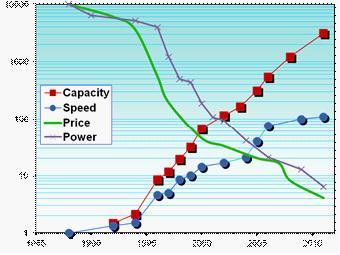
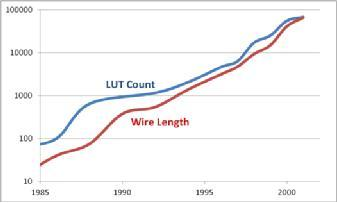
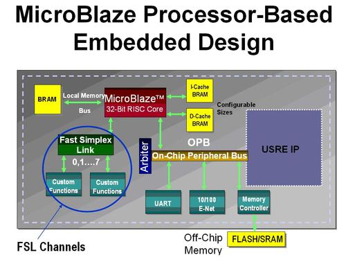
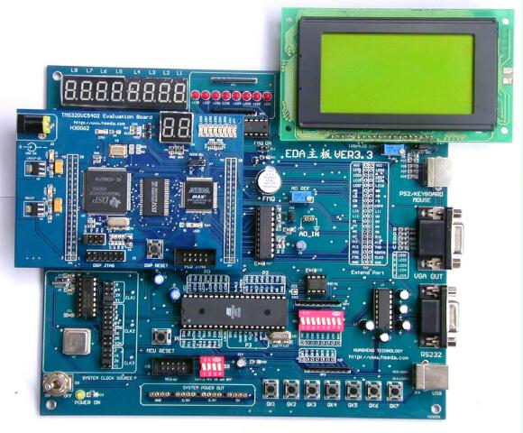
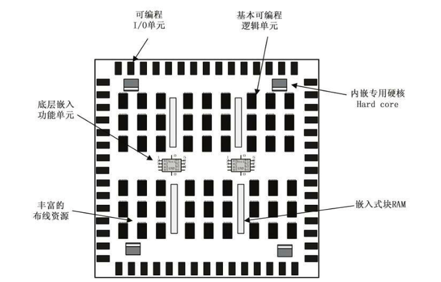
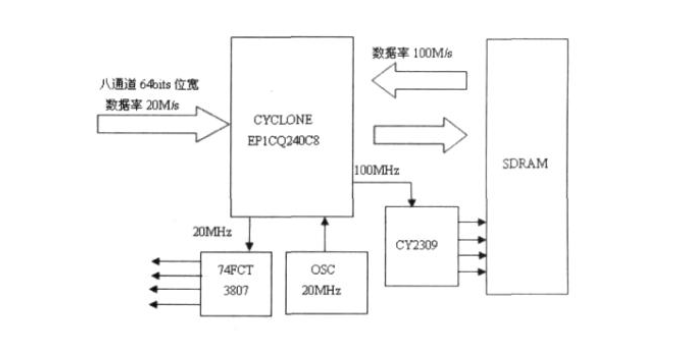
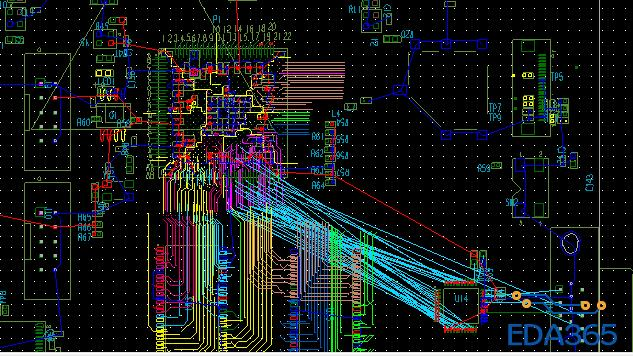
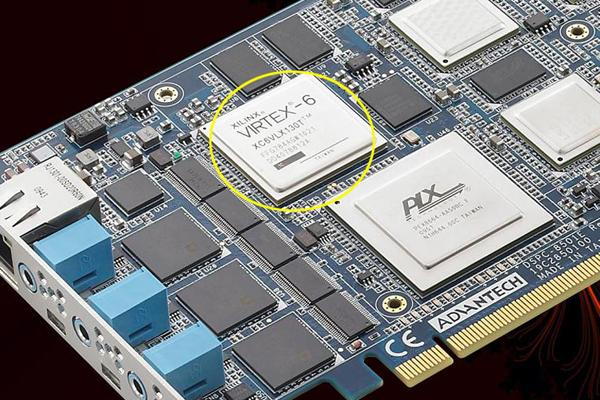

# FPGA

来源 1：https://baike.baidu.com/item/FPGA/935826?fr=aladdin

来源 2：https://www.zhihu.com/topic/19570427/intro

FPGA 是 Filed Programmable Gate Array 的缩写，即现场可编程逻辑阵列。**FPGA 是在 CPLD 的基础上发展起来的新型高性能可编程逻辑器件**，一般采用 SRAM 工艺，也有一些专用器件采用 Flash 工艺或反熔丝（Anti-Fuse）工艺等。FPGA 的集成度很高，其器件密度从数万系统门到数千万系统门不等，可以完成极其复杂的时序与组合逻辑电路功能，适用于高速、高密度的高端数字逻辑电路设计领域。

FPGA示意图:

## 一、FPGA的发展历史

FPGA 器件自问世以来，已经经过了几个不同的发展阶段。驱动每个阶段发展的因素都是工艺技术和应用需求。正是这些驱动因素，导致器件的特性和工具发生了明显的变化。

赛灵思于 1984 年发明了世界首款 FPGA，那个时候还不叫 FPGA，直到 1988 年 Actel 才让这个词流行起来。接下来的 30 年里，这种名为 FPGA 的器件，在容量上提升了一万多倍，速度提升了 一百倍，每单位功能的成本和能耗降低了一万多倍！

### 发明时代：1984-1992 年

首款 FPGA，即赛灵思 XC2064，只包含 64 个逻辑模块，每个模块含有两个 3 输入查找表 (LUT) 和一个寄存器。按照现在的计算，该器件有 64 个逻辑单元——不足 1000 个逻辑门。尽管容量很小，XC2064 晶片的尺寸却非常大，比当时的微处理器还要大;而且采用 2.5 微米工艺技术勉强能制造出这种器件。

### 扩展时代：1992-1999 年

FPGA 初创公司都是无晶圆厂的公司，在当时属于新鲜事物。由于没有晶圆厂，他们在上世纪 90 年代初期通常无法获得领先的芯片技术。因此 FPGA 开启了扩展时代，此时落后于 IC 工艺的发展。到上世纪 90 年代后期，IC 代工厂意识到 FPGA 是理想的工艺发展推动因素，由此 FPGA 成为扫除工艺发展障碍的利器。代工厂只要能用新工艺产出晶体管和电线，就能制造基于 SRAM 的 FPGA。**每一代新工艺的出现都会将晶体管数量增加一倍，使每功能成本减半，并将最大 FPGA 的尺寸增大一倍。**化学-机械抛光(CMP)技术允许代工厂在 IC 上堆叠更多金属层，使 FPGA 厂商能够大幅增加片上互联，以适应更大的 LUT 容量(如下图)。

FPGA LUT 和互连线路的增加。线路长度以数百万晶体管间距来测量

### 积累时代：2000-2007 年

新千年伊始，FPGA 已成为数字系统中的通用组件。容量和设计尺寸快速增加，FPGA 在数据通信领域开辟了巨大市场。2000年代初期互联网泡沫破灭之后，迫切需要降低成本，这也减少了很多“临时”ASIC 用户。定制芯片对小的研发团队来说风险太大。当他们发现FPGA可以解决他们的问题，自然他们就变成了 FPGA 用户。

FPGA 问题不局限于典型问题，单纯提高容量不足以保证市场增长。FPGA 厂商通过如下两种方式解决了这一挑战。针对低端市场，厂商再度关注效率问题，并生产低容量、低性能、“低成本”的 FPGA 系列，例如赛灵思 Spartan® FPGA 系列。针对高端市场，FPGA 厂商通过开发针对重要功能的软逻辑 (IP) 库，努力让客户更方便地填充最大的 FPGA。**这些软逻辑功能中最值得注意的是存储器控制器、各种通信协议模块(包括以太网 MAC)，甚至软微处理器(如赛灵思 MicroBlaze™ 处理器)。**

MicroBlaze 硬件架构图:

### 系统时代：2008 年以后

为解决系统设计问题，**FPGA 越来越多地整合系统模块：高速收发器、存储器、DSP 处理单元和完整处理器。同时还进一步集成了重要控制功能：比特流加密与验证、混合信号处理、电源与温度监控以及电源管理等。**这些特性在 Zynq All-Programmable 器件中得到了充分体现。同时，器件也推动了工具的发展。系统 FPGA 需要高效的系统编程语言，现可利用 OpenCL 和 C 语言以类似软件的流程来编程。

可编程性的基本价值已经为业界所共识，小型、高效的逻辑操作可加速很多重要算法并降低功耗，FPGA 技术会持续存在， 并不断发展演进。

## 二、可编程逻辑器件的分类

广义上讲，**「可编程逻辑器件」是指一切通过软件手段更改、配置器件内部连接结构和逻辑单元，完成既定设计功能的数字集成电路**。目前常用的可编程逻辑器件主要有简单的逻辑阵列（PAL/GAL）、复杂可编程逻辑器件（CPLD）和现场可编程逻辑阵列（FPGA）等 3 大类。

### 1、PAL/GAL

PAL 是 Programmable Array Logic 的缩写，即**可编程阵列逻辑**；GAL 是 Generic Array Logic 的缩写，即通用可编程阵列逻辑。PAL/GAL 是早期可编程逻辑器件的发展形式，其特点是大多基于 E 2 CMOS 工艺，结构较为简单，可编程逻辑单元多为与阵列和或阵列，可编程单元密度较低。**但是它们一出现即以其低功耗、低成本、高可靠性、软件可编程、可重复更改等特点引发了数字电路领域的巨大振动。**虽然目前较复杂的逻辑电路一般使用 CPLD 甚至 FPGA 完成，但是对于很多简单的数字逻辑，GAL 等简单的可编程逻辑器件仍然被大量使用。

目前，国内外很多对成本十分敏感的设计都在使用 GAL 等低成本可编程逻辑器件，越来越多的 74 系列逻辑电路被 GAL 取代。GAL 等器件发展至今已经 20 多年，新一代的 GAL 以功能灵活、小封装、低成本、重复可编程、应用灵活等优点仍然在数字电路领域扮演着重要的角色。目前，比较大的 GAL 器件供应商主要是 Lattice 半导体。

### 2、CPLD

CPLD 是 Complex Programmable Logic Device 的缩写，即**复杂的可编程逻辑器件**。Altera 为了突出特性，曾将自己的 CPLD 器件称为 EPLD（Enhanced Programmable Logic Device），即增强型可编程逻辑器件。其实 EPLD 和 CPLD 属于同等性质的逻辑器件，目前 Altera 为了遵循称呼习惯，已经将其 EPLD 统称为 CPLD。CPLD 是在 PAL、GAL 的基础上发展起来的，一般采用 E2CMOS 工艺，也有少数厂商采用 Flash 工艺，**其基本结构由可编程 I/O 单元、基本逻辑单元、布线池和其他辅助功能模块构成。**CPLD 可实现的逻辑功能比 PAL 和 GAL 有了大幅度提升，一般可以完成设计中较复杂、较高速度的逻辑功能，如接口转换、总线控制等。CPLD 的主要器件供应商有 Altera、Lattice 和 Xilinx 等。

CPLD产品图：

### 3、FPGA

FPGA 是 Filed Programmable Gate Array 的缩写，即现场可编程逻辑阵列。FPGA 是在 CPLD 的基础上发展起来的新型高性能可编程逻辑器件，一般采用 SRAM 工艺，也有一些专用器件采用 Flash 工艺或反熔丝（Anti-Fuse）工艺等。FPGA 的集成度很高，其器件密度从数万系统门到数千万系统门不等，可以完成极其复杂的时序与组合逻辑电路功能，适用于高速、高密度的高端数字逻辑电路设计领域。**FPGA 的基本组成部分有可编程输入/输出单元、基本可编程逻辑单元、嵌入式块 RAM、丰富的布线资源、底层嵌入功能单元、内嵌专用硬核等。**FPGA 的主要器件供应商有 Xilinx、Altera、Lattice、Actel 和 Atmel 等。

FPGA 的基本组成部分有可编程输入/输出单元、基本可编程逻辑单元、嵌入式块 RAM、丰富的布线资源、底层嵌入功能单元、内嵌专用硬核等，如下图所示：

#### 1）可编程输入/输出单元

输入/输出（Input/Output）单元，简称 I/O 单元，它们是芯片与外界电路的接口部分，完成不同电气特性下对输入/输出信号的驱动与匹配需求。为了使 FPGA 有更灵活的应用，目前大多数 FPGA 的 I/O 单元被设计为可编程模式，即通过软件的灵活配置，可以适配不同的电气标准与 I/O 物理特性；可以调整匹配阻抗特性，上/下拉电阻；可以调整输出驱动电流的大小等。

可编程 I/O 单元支持的电气标准因工艺而异，不同器件商不同器件族的 FPGA 支持的 I/O 标准也不同，一般说来，**常见的电气标准有 LVTTL、LVCMOS、SSTL、HSTL、LVDS、LVPECL 和 PCI 等**。值得一提的是，随着 ASIC 工艺的飞速发展，目前可编程 I/O 支持的最高频率越来越高，一些高端 FPGA 通过 DDR 寄存器技术，甚至可以支持高达 2Gbit/s 的数据速率。

I/O接口示意图：

#### 2）基本可编程逻辑单元

基本可编程逻辑单元是可编程逻辑的主体，可以根据设计灵活地改变其内部连接与配置，完成不同的逻辑功能。**FPGA 一般是基于 SRAM 工艺的，其基本可编程逻辑单元几乎都是由查找表（LUT，Look Up Table）和寄存器（Register）组成的。**FPGA 内部查找表一般为 4 输入（注：Altera Stratix Ⅱ 的自适应逻辑模块 ALM 结构比较特殊），查找表一般完成纯组合逻辑功能。FPGA 内部寄存器结构相当灵活，可以配置为带同步/异步复位或置位、时钟使能的触发器（FF，Flip Flop），也可以配置成为锁存器（Latch）。

逻辑电路与查找表对应图：

FPGA 一般依赖寄存器完成同步时序逻辑设计，比较经典的基本可编程单元的配置是一个寄存器加一个查找表，但是不同厂商的寄存器和查找表的内部结构有一定的差异，而且寄存器和查找表的组合模式也不同。例如，Altera 可编程逻辑单元通常被称为 LE（Logic Element，逻辑单元），由一个 Register 加一个 LUT 构成。Altera 的大多数 FPGA 将 10 个 LE 有机地组合起来，构成更大的功能单元――逻辑阵列模块（LAB，Logic Array Block），LAB 中除了 LE 还包含 LE 间的进位链、LAB 控制信号、局部互联线资源、LUT 级联链、寄存器级联链等连线与控制资源。

#### 3）嵌入式块 RAM

目前大多数 FPGA 都有内嵌的块 RAM（Block RAM）。**FPGA 内部嵌入可编程 RAM 模块，大大地拓展了 FPGA 的应用范围和使用灵活性。**FPGA 内嵌的块 RAM 一般可以灵活配置为单端口 RAM（SPRAM，Single Port RAM）、双端口 RAM（DPRAM，Double Ports RAM）、伪双端口 RAM（Pseudo DPRAM）、CAM（Content Addressable Memory）、FIFO （First In First Out）等常用存储结构。

FPGA中双端口RAM示意图：

#### 4）丰富的布线资源

布线资源连通 FPGA 内部所有单元，连线的长度和工艺决定着信号在连线上的驱动能力和传输速度。**FPGA 内部有着非常丰富的布线资源，这些布线资源根据工艺、长度、宽度和分布位置的不同而被划分为不同的等级。**

有一些是全局性的专用布线资源，用以完成器件内部的全局时钟和全局复位/置位的布线；一些叫作长线资源，用以完成器件 Bank（分区）间的一些高速信号和一些第二全局时钟信号（有时也被称为 Low Skew 信号）的布线；还有一些叫作短线资源，用以完成基本逻辑单元之间的逻辑互联与布线；另外，在基本逻辑单元内部还有着各式各样的布线资源和专用时钟、复位等控制信号线。

#### 5）底层嵌入功能单元

底层嵌入功能单元的概念比较笼统，这里我们指的是那些通用程度较高的嵌入式功能模块，比如 PLL（Phase Locked Loop）、DLL（Delay Locked Loop）、DSP、CPU 等。随着 FPGA 的发展，这些模块被越来越多地嵌入到 FPGA 的内部，以满足不同场合的需求。

#### 6）内嵌专用硬核

这里的内嵌专用硬核与前面的「底层嵌入单元」是有区分的，这里讲的内嵌专用硬核通用性相对较弱，不是所有 FPGA 器件都包含硬核（Hard Core）。

我们称 FPGA 和 CPLD 为通用逻辑器件，是区分于专用集成电路（ASIC）而言的。**其实 FPGA 内部也有两个阵营：一方面是通用性较强，目标市场范围很广，价格适中的 FPGA；另一方面是针对性较强，目标市场明确，价格较高的 FPGA。**前者主要指低成本（Low Cost）FPGA，后者主要指某些高端通信市场的可编程逻辑器件。[6]

例如，Altera 的 Stratix IV GX 器件族内部集成了 8.5Gbit/s SERDES（串并收发单元）；Xilinx 的对应器件族是 Virtex 5 和 Virtex 6；Lattice 器件的专用 Hard Core 的比重更大，有两类器件族支持 SERDES 功能，分别是 Lattice 高端 SC 系列 FPGA 和现场可编程系统芯片（FPSC，Field Programmable System Chip）。目前，Altera、Lattice 和 Xilinx 都已经推出内嵌 10Gbit/s SERDES 模块的系统级可编程逻辑器件。

Virtex 6 FPGA产品：

## 三、工作原理

FPGA采用了[逻辑单元](https://baike.baidu.com/item/逻辑单元)阵列LCA（Logic Cell Array）这样一个概念，内部包括可配置逻辑模块CLB（Configurable Logic Block）、输入输出模块IOB（Input Output Block）和内部连线（Interconnect）三个部分。 现场可编程门阵列（FPGA）是可编程器件，与传统逻辑电路和门阵列（如PAL，GAL及CPLD器件）相比，FPGA具有不同的结构。

- FPGA利用小型查找表（16×1RAM）来实现组合逻辑，每个查找表连接到一个D触发器的输入端，触发器再来驱动其他逻辑电路或驱动I/O，由此构成了既可实现组合逻辑功能又可实现时序逻辑功能的基本逻辑单元模块
- 这些模块间利用金属连线互相连接或连接到I/O模块
- FPGA的逻辑是通过向内部静态存储单元加载编程数据来实现的
- 存储在存储器单元中的值决定了逻辑单元的逻辑功能以及各模块之间或模块与I/O间的联接方式
- 并最终决定了FPGA所能实现的功能
- FPGA允许无限次的编程

## 四、芯片设计

相比于其他种类的芯片设计，关于 FPGA芯片通常需要设置较高门槛并且拟定严格性较强的基本设计流程。具体在设计时，应当紧密结合 FPGA 的有关原理图，据此实现了规模较大的专门芯片设计。通过运用[Matlab](https://baike.baidu.com/item/Matlab/263035)以及[C语言](https://baike.baidu.com/item/C语言/105958)的特殊设计算法，应当可以实现全方位的顺利转化，从而确保其符合当前的主流芯片设计思路。在此前提下，如果选择了上述设计思路那么通常需要着眼于有序整合各类元器件以及相应的设计语言，据此保证了可用性与可读性较强的芯片程序设计。运用 FPGA可以实现板机调试、代码仿真与其他有关的设计操作，确保当前的代码编写方式以及设计方案都能符合特定的设计需求。 除此以外，关于设计算法应当将合理性置于首要性的位置， 据此实现了优化的项目设计效果，并且优化了芯片运行的实效性。因此作为设计人员来讲，首先就是要构建特定的算法模块， 以此来完成与之有关的芯片代码设计。这是由于预先设计代码有助保证算法可靠性，对于整体上的芯片设计效果也能予以显著优化。在全面完成[板机](https://baike.baidu.com/item/板机/1452228)调试以及仿真测试的前提下，应当可以在根源上缩短设计整个芯片消耗的周期，同时也致力于优化当前现存的硬件整体结构。例如在涉及到开发非标准的某些硬件接口时，通常都会用到上述的新产品设计模式。 [3] 

FPGA设计的主要难点是熟悉硬件系统以及内部资源，保证设计的语言能够实现元器件之间的有效配合，提高程序的可读性以及利用率。这也对设计人员提出了比较高的要求，需要经过多个项目的经验积累才可以达到相关的要求。 [3] 

在算法设计时需要重点考虑合理性，保证项目最终完成的效果，依据项目的实际情况提出解决问题的方案，提高FPGA的运行效率。确定算法后应当合理构建模块，方便后期进行代码设计。在代码设计时可以利用预先设计好的代码，提高工作效率，增强可靠性。编写测试平台，进行代码的仿真测试和板机调试，完成整个设计过程。FPGA同[ASIC](https://baike.baidu.com/item/ASIC/2014676)不同，开发的周期比较短，可以结合设计要求改变硬件的结构，在通信协议不成熟的情况下可以帮助企业迅速推出新产品，满足非标准接口开发的需求。 [3] 

## 五、优缺点

### 优点

(1) FPGA由逻辑单元、[RAM](https://baike.baidu.com/item/RAM/144481)、乘法器等硬件资源组成，通过将这些硬件资源合理组织，可实现[乘法器](https://baike.baidu.com/item/乘法器/4144271)、寄存器、地址发生器等硬件电路。 [5] 

(2) FPGA可通过使用框图或者Verilog HDL来设计，从简单的门电路到[FIR](https://baike.baidu.com/item/FIR/345936)或者[FFT](https://baike.baidu.com/item/FFT/4766072)电路。 

(3) FPGA可无限地重新编程，加载一个新的设计方案只需几百毫秒，利用重配置可以减少硬件的开销。 

(4) FPGA的工作频率由FPGA芯片以及设计决定，可以通过修改设计或者更换更快的芯片来达到某些苛刻的要求（当然，工作频率也不是无限制的可以提高，而是受当前的IC工艺等因素制约）。 

### 缺点

(1) FPGA的所有功能均依靠硬件实现，无法实现分支条件跳转等操作。 

(2) FPGA只能实现定点运算。

总结：FPGA依靠硬件来实现所有的功能，速度上可以和专用芯片相比，但设计的灵活度与通用处理器相比有很大的差距。

## 六、设计语言及平台

可编程逻辑器件是通过[EDA](https://baike.baidu.com/item/EDA/182009)技术将电子应用系统的既定功能和技术指标具体实现的硬件载体，FPGA作为实现这一途径的主流器件之一，具有直接面向用户，灵活性和通用性极大，使用方便，硬 件测试和实现快捷等特点。

硬件描述语言（HDL）是一种用来设计数字逻辑系统和描述数字电路的语言，常用的主要有[VHDL](https://baike.baidu.com/item/VHDL/105618)、[Verilog HDL](https://baike.baidu.com/item/Verilog HDL/596353)、System Verilog 和 System C。

作为一种全方位的硬件描述语言，超高速集成电路硬件描述语言（VHDL）具有与具体硬件电路无关、与设计平台无关的特性，具有宽范围描述能力、不依赖于特定的器件、可将复杂控制逻辑的设计用严谨简洁的代码进行描述等优点，得到众多EDA公司的支持，在电子设计领域得到了广泛应用。

VHDL是一种用于电路设计的高级语言，与其他硬件描述语言相比，其具有语言简洁、灵活性强、不依赖于器件设计等特点，使其成为EDA技术通用的硬件描述语言，使EDA技术更便于设计者掌握。

Verilog HDL是广泛应用的硬件描述语言，可以用于硬件设计流 程的建模、综合、模拟等多个阶段。

Verilog HDL 优点：类似C语言，上手容易，灵活。大小写敏感。在写激励和建模方面有优势。缺点：很多错误在编译的时候不能被发现。

VHDL 优点：语法严谨，层次结构清晰。缺点：熟悉时间长，不够灵活。

Quartus_Ⅱ软件是由Altera公司开发的完整多平台设计环境，能满足各种FPGA，[CPLD](https://baike.baidu.com/item/CPLD/2527470)的设计需要，是片上可编程系统设计的综合性环境。

Vivado设计套件，是FPGA厂商赛灵思公司（Xilinx）2012年发布的集成设计环境。包括高度集成的设计环境和新一代从系统到IC级的工具，这些均建立在共享的可扩展数据模型和通用调试环境基础上。Xilinx Vivado设计套件中提供了FIFO IP核，可方便应用于设计中。

## 七、行业应用

### 1、视频分割系统

近年来，大型的总控系统得到了日益广泛的应用，与之相关的视频分割技术水平也在逐步提高，该技术是把用多屏拼接显示的方式来显示一路视频信号，在一些需要使用大屏幕显示的场景应用广泛。 [2] 

随着技术水平的进步， 视频分割技术逐步成熟，满足了人们对于清晰视频图像的基本需求、 FPGA 芯片硬件结构比较特殊，可以利用事先编辑的逻辑结构文件调整内部结构，利用约束的文件来调整不同逻辑单元的连接和位置，妥善处理好数据线路径，其自身具有的灵活性和适应性方便用户的开发和应用。在处理视频信号时，FPGA芯片可以充分利用自身的速度和结构优势，实现兵乓技术和流水线技术。在对外连接的过程中，芯片采用数据并行连接的方式，使图像信息的位宽拓宽，利用内部的逻辑功能提高图像处理的速度。通过高速缓存结构以及时钟管理实现对图像处理以及其他设备的控制。在整体的设计结构中，FPGA芯片处于核心位置，复杂数据的插值处理以及提取和存储，还起到总体控制的作用，保证系统的稳定运行。另外，视频信息处理与其他数据处理不同，需要芯片具有特殊的逻辑单元以及[RAM](https://baike.baidu.com/item/RAM/144481)或者[FIFO](https://baike.baidu.com/item/FIFO/64838)单元，保证提高足够的数据传输速度。 [2] 

### 2、数据延迟器和存储设计

FPGA具有可编程的延迟数字单元，在通信系统和各类电子设备中有着比较广泛的应用，比如同步通信系统，时间数值化系统等，主要的设计方法包括数控延迟线法，存储器法，计数器法等，其中存储器法主要是利用 FPGA的RAM或者FIFO实现的。 [2] 

利用 FPGA 对[SD卡](https://baike.baidu.com/item/SD卡/122767)相关数据进行读写可以依据具体算法的需求低FPGA芯片开展编程，更加实际情况的变化实现读写操作的不断更新。这种模式之下只需要利用原有的芯片便可以实现对SD卡的有效控制，明显降低了系统的成本。 [2] 

### 3、通信行业

通常情况下，通信行业综合考虑成本以及运营等各方面的因素，在终端设备数量比较多的位置，FPGA的用量比较大，基站最适合使用FPGA，基站几乎每一块板子都需要使用FPGA芯片，而且型号比较高端，可以处理复杂的物理协议，实现逻辑控制。同时，由于基站的逻辑链路层，物理层的协议部分需要定期更新，也比较适合采用FPGA技术。目前，FPGA主要在通信行业的建设初期和中期应用，后期逐步被ASIC替代。 [2] 

### 4、其它应用

FPGA在安防，工业等领域也有着比较广泛的应用，比如安防领域的视频编码解码等协议在前端数据采集和逻辑控制的过程中可以利用FPGA处理。工业领域主要采用规模较小的FPGA，满足灵活性的需求。另外，由于 FPGA具有比较高的可靠性，因此在军工以及航天领域也有比较广泛的应用。未来，随着技术的不断完善，相关工艺将会完成升级改造， 在诸多新型行业比如大数据等，FPGA将会有更为广泛的应用前景。伴随5G网络的建设， 初期会大量应用FPGA，[人工智能](https://baike.baidu.com/item/人工智能/9180)等新型的领域也会更多的用到FPGA。 [2] 

2021年2月，先购买再设计的FPGA（现场可编程门阵列）被称为“万能芯片”。国内最早自主研发、规模生产、批量销售通用FPGA芯片的企业之一京微齐力公司敲定，将在亦庄投资3亿元建设新一代国产FPGA芯片研发与产业化项目。 [10] 