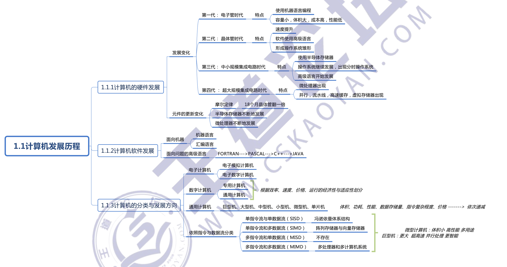
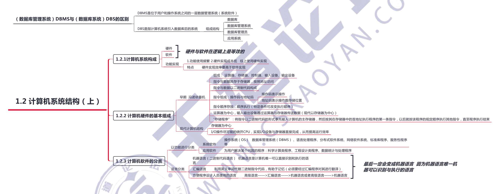
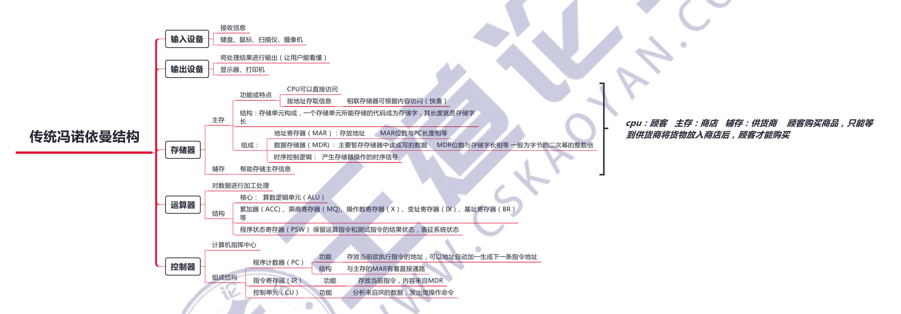
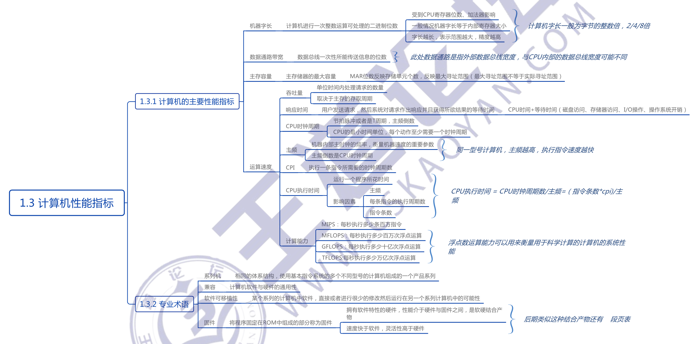

# 计算机系统概述

## 1.1 计算机发展历程

## 1.2 计算机系统结构

图 1.4 所示为冯•诺依曼结构的模型机。CPU 包含 ALU、通用寄存器组 GPRs、标志寄存器、控制器、指令奇存器 R、程序计数器 PC、存储器地址寄存器 MAR 和存储器数据寄存器MDR。图中从控制器送出的虛线就是控制信号，可以控制如何修改 PC 以得到下一条指令的地址，可以控制 ALU 执行什么运算，可以控制主存是进行读操作还是写操作(读/写控制信号)

CPU 和主存之间通过一组总线相连，总线中有地址、控制和数据 了 组信号线。MAR 中的地址信息会直接送到地址线上，用于指向读/写操作的主存存储单元：控制线中有读/写信号线，指出数据是从 CPU 写入主存还是从主存读出到 CPU，根据是读操作还是写操作来控制将 MDR 中的数据是直接送到数据线上还是将数据线上的数据接收到 MDR 中。

## 1.3 计算机性能指标

## 常见问题

### 1）计算机由哪几部分组成？以哪部分为中心？

**计算机由运算器、控制器、存储器、输入设备及输出设备五大部分构成，现代计算机通常把运算器和控制器集成在一个芯片上，合称为中央处理器。**

而在微处理器面世之前，运算器和控制器分离，而且存储器的容量很小，因此设计成以**运算器为中心**的结构，其他部件都通过运算器完成信息的传递。

随着徽电子技术的进步，同时计算机需要处理、加工的信息量也与日俱增，大量 VO 设备的速度和 CPU 的速度差距悬殊，因此以运算器为中心的结构不能满足计算机发展的要求。现代计算机己经发展为以**存储器为中心**，使VO操作尽可能地统过 CPU，直接在 V 设备和存储器之间完成，以提高系统的整体运行效率。

### 2）主频高的 CPU一定比主频低的CPU 快吗？为什么？

衡量 CPU 运算速度的指标有很多，不能以单独的某个指标来判断 CPU 的好坏。CPU 的主频，即 CPU 内核工作的时钟频率。CPU 的主频表示 CPU 内数字脉冲信号振荡的速度，主频和实际的运算速度存在一定的关系，但目前还没有一个确定的公式能够定量两者的数值关系，因为 CPU 的运算速度还要看 CPU 的流水线的各方面的性能指标 （架构、缓存、指令集、CPU 的位数、Cache 大小等）。**由于主频井不直接代表运算速度，因此在一定情况下很可能会出现主频较高的 CPU 实际运算速度较低的现象。**

### 3）翻译程序、汇编程序、编译程序、解释程序有什么差别？各自的特性是什么？

翻译程序是指把高级语言源程序翻译成机器语言程序 （目标代码）的软件。

翻译程序有两种：

- 一种是编译程序，它將高级语言源程序一次全部翻译成目标程序，每次执行程序时，只需执行目标程序，因此只要源程序不变，就无须重新翻译，请注意同一种高级语言在不同体系结构下，编译成目标程序是不一样的，目标程序与体系结构相关，但仍不是计算机硬件能够直接执行的程序。c++
- 另一种是解释程序，它将源程序的一条语句翻译成对应的机器目标代码，并立即执行，然后翻译下一条源程序语句并执行，直至所有源程序语句全部被翻译并执行完。所以解释程序的执行过程是翻译一句执行一句，并且不会生成目标程序。python

汇编程序也是一种语言翻译程序，它把汇编语言源程序翻译为机器语言程序。汇编语言是一种面向机器的低级语言，是机器语言的符号表示，与机器语言一一对应。

编译程序与汇编程序的区别：若源语言是诸如C、C+t、Java 等“高级语言”，而目标语言是诸如汇编语言或机器语言之类的“低级语言”，则这样的一个翻译程序称为编译程序。若源语言是汇编语言，而目标语言是机器语言，则这样的一个翻译程序称为汇编程序。

### 4）不同級別的语言縮写的程序有什么区別？哪种语言编写的程序能被硬件直接执行？

机器语言和汇编语言与机器指令对应，而高级语言不与指令直接对应，具有较好的可移植性。其中机器语言可以被硬件直接执行。

### 5）同一个功能既可以由软件实现又可以由硬件实现吗？

软件和硬件是两种完全不同的形态，硬件是实体，是物质基础；软件是一种信息，看不见、摸不到。但在逻辑功能上，软件和硬件是等效的。因此，在计算机系统中，许多功能既**可以由硬件直接实现，又可以在硬件的配合下由软件实现**。

例如，乘法运算既可用专门的乘法器（主要由加法器和移位器组成）实现，也可用乘法子程序（主要由加法指令和移位指令等组成）来实现。

### 6）什么是透明性？透明是指什么都能看见吗？

在计算机领域中，站在某类用户的角度，若感觉不到某个事物或属性的存在，**即“看”不到某个事物或属性，则称为 “对该用户而言，某个事物或属性是透明的”。这与日常生活中的“透明”概念（公开、看得见）正好相反**

例如，对于高级语言程序员来说，浮点数格式、乘法指令等这些指令的格式、数据如何在运算器中运算等都是透明的；而对于机器语言或汇编语言程序员来说，指令的格式、机器结构、数据格式等则不是透明的。

在CPU中，R、MAR 和MDR 对各类程序员都是透明的。

### 7） 机器字长、指令字长、存储字长的区别和联系是什么？

- 机器字长：计算机能直接处理的二进制数据的位数，机器字长一般等于内部寄存器的大小，它决定了计算机的运算精度。
- 指令字长：一个指令字中包含的二进制代码的位数。
- 存储字长：一个存储单元存储的二进制代码的长度。

**它们都必须是字节的整数倍。**

指令字长一般取存储字长的整数倍，若指令字长等于存储字长的 2倍，则器要 2次访存来取出一条指令，因此取指周期为机器周期的 2倍：若指令字长等于存储字长，则取指周期等于机器周期。

早期的计算机存储字长一般和机器的指令字长与数据字长相等，因此访问一次主存便可取出一条指令或一个数据。随着计算机的发展，指令字长可变，数据字长也可变，但它们必须都是字节的整数倍。

请注意 64 位操作系统是指特别为 64 位架构的计算机而设计的操作系统，它能够利用 64位处理器的优势。但 64位机器既可以使用 64 位操作系统，又可以使用 32 位操作系统。而 32 位处理器是无法使用 64 位操作系统的，

### 8）计算机体系结构和计算机组成的区别和联系是什么？

**计算机体系结构**是指机器语言或汇编语言程序员所看得到的传统机器的属性，包括指令集、数据类型、存储器寻址技术等，大都属于**抽象的属性**

**计算机组成是指如何实现计算机体系结构所体现的属性，它包含对许多对程序员来说透明的硬件细节**。例如，指令系统属于结构的问题，但指令的实现即如何取指令、分析指令、取操作数、如何运算等都属于组成的问题。因此，当两台机器指令系统相同时，只能认为它们具有相同的结构，至于这两台机器如何实现其指令，完全可以不同，即可以认为它们的组成方式是不同的。例如，一台机器是否具备乘法指令是一个结构的问题，但实现乘法指令采用什么方式则是一个组成的问题。

许多计算机厂商提供一系列体系结构相同的计算机，而它们的组成却有相当大的差别，即使是同一系列的不同型号机器，其性能和价格差异也很大。例如，LBM System/370 结构就包含了名种价位和性能的机型。

### 9）基准程序执行得越快说明机器的性能越好吗？

一般情况下，基准测试程序能够反映机器性能的好坏。但是，由于基准程序中的语句存在频度的差异，因此运行结果并不能完全说明问题。