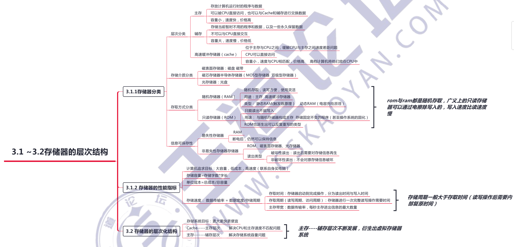
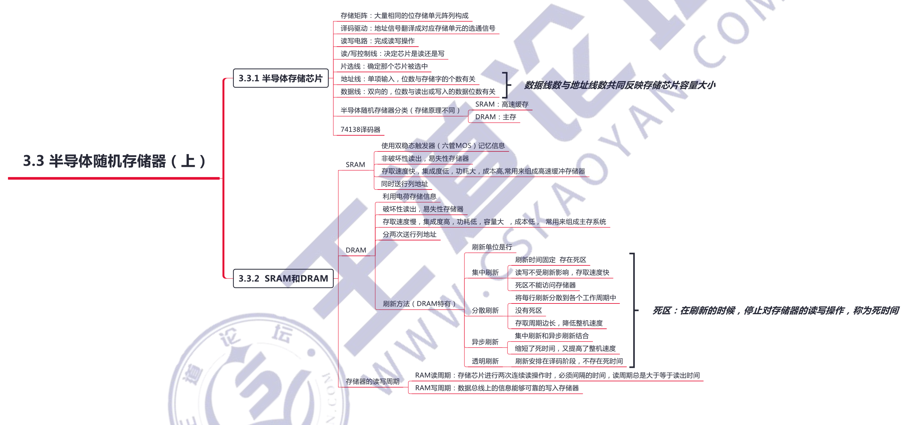
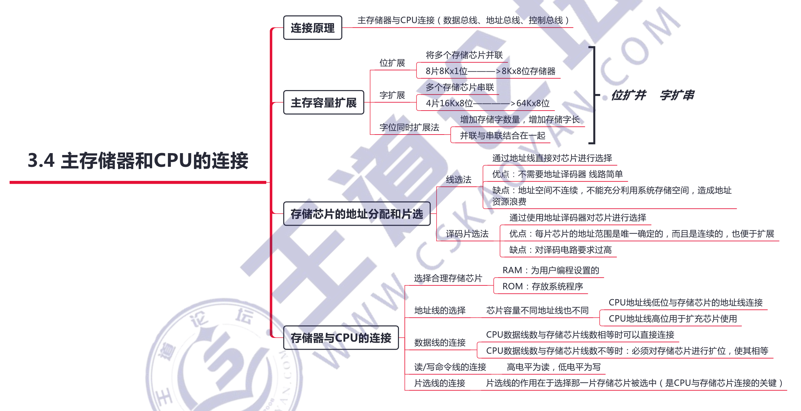
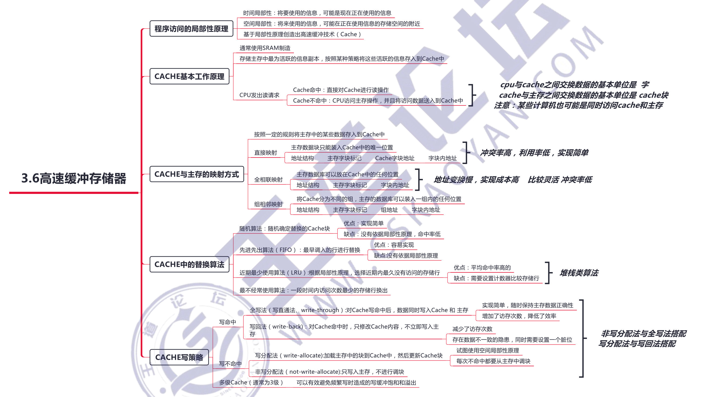

# 存储系统

## 3.1～3.2 存储器的分类、性能指标、层次化结构

补充第三种存取方式分类：串型访问存储器

对存储单元进行读/写操作时，两按其物理位置的先后顺序导址，包括顺序存取存储器（如磁带）与直接存取存储器（如磁盘、光盘）。

- 顺序存取存储器的内容只能按某种顺序存取，存取时间的长短与信息在存储体上的物理位置有关，其特点是存取逃度慢。
- 直接存取存储器既不像 RAM 那样随机地访问任何一个存储单元，又不像顺序存取存储器那样完全按顺序存取，而是介于两者之间。存取信息时通常先寻找整个存储器中的某个小区域（如磁盘上的磁道），再在小区域内顺序查找。

## 3.3 半导体随机存储器

### 1）SRAM 和 DRAM

**存储芯片内部结构**

存储器芯片由存储体、IO 读写电路、地址译码和控制电路等部分组成

- 存储体（存储矩阵）。存储体是存储单元的集合，它由行选择线(X）和列选择线(Y）来选择所访问单元，存储体的相同行、列上的位同时被读出或写入。
- 地址译码器。用来將地址转换为译码输出线上的高电平，以便驱动相应的读写电路。
- IO 控制电路。用以控制被选中的单元的读出或写入，具有放大信息的作用。
- 片选控制信号。单个芯片容量太小，往往满足不了计算机对存储器容量的要求，因此需用一定数量的芯片进行存储器的扩展。在访问某个字时，必须“选中， 该存储字所在的芯片，而其他芯片不被 “选中”，因此需要有片选控制信号。
- 读/写控制信号。根据 CPU 给出的是读命令还是写命令，控制被选中单元进行读或写

**SRAM 和 DRAM 的比较**

### 2）ROM

### 3）主存储器基本组成和使用

由一个个存储0 或1的**记忆单元**（也称存備元件〉构成的**存储矩阵**（也称存储体）是存储器的核心部分。为了存取存储体中的信息，必须对存储单元编号（也称编址）。

指令执行过程中需要访问主存时，**CPU 首先把被访问单元的地址送到 MAR 中，然后通过地址线将主存地址送到主存中的地址寄存器**，以便地址译码器进行译码选中相应单元，同时CPU 将读写信号通过控制线送到主存的读写控制电路。**如果是写操作，那么CPU 同时将要写的信息送到 MDR 中，在读写控制电路的控制下，经数据线将信号写入选中的单元**；**如果是读操作，那么主存读出选中单元的内容送到数据线，然后送到 MDR 中**。数据线的宽度与 MDR 的宽度相同，地址线的宽度与 MAR 的宽度相同。地址线的位数决定了主存地址空间的最大可寻址范围。例如，36位地址的最大导址范国为 0~2^36-1，即地址从 。 开始编号。

## 3.4 主存储器和CPU的连接

## 3.5 双端口RAM和多模块存储器

## 3.6 高速缓冲存储器

**Cache 位于存储器层次结构的顶层，通常由 SRAM 构成**，其基本结构如图 3.17所示

为便于 Cache 和主存之间交换信息，Cache 和主存都被划分为相等的块，Cache 块又称Cache 行，每块由若干字节组成，块的长度称为块长（Cache 行长）。由于 **Cache 的容量远小于主存的容量**，所以 Cache 中的块数要远少于主存中的块数，它**仅保存主存中最活跃的若干块的副本**。因此 Cache 按照某种策略，预测 CPU 在未来一段时间内欲访存的数据，将其裝入Cache.

当 CPU 发出读请求时：

- 若访存地址在 Cache 中命中，就将此地址转换成 Cache 地址，直接对 Cache 进行读操作，与主存无关
- 若 Cache 不命中，则仍需访问主存，并把此字所在的块一次性地从主存调入 Cache。若此时 Cache 己满，则需根据某种替换算法，用这个块替换 Cache 中原来的某块信息

当 CPU 发出写请求时，若 Cache 命中，有可能会遇到 **Cache 与主存中的内容不一致的问题**。例如，由于 CPU 写 Cache, 把 Cache 某单元中的内容从 ×修改成了 X，而主存对应单元中的内容仍然是x，没有改变。所以**若 Cache 命中，需要按照一定的写策略处理，常见的处理方法有全写法和写回法**

## 3.7 虚拟存储器

**「虚拟存储器」将「主存」或「辅存」的地址空间统一编址**，形成一个庞大的地址空间，在这个空间内，用户可以自由编程，而不必在乎实际的主存容量和程序在主存中实际的存放位置。

**用户编程允许涉及的地址称为虚地址或逻辑地址**，虚地址对应的存储空间称为虚拟空间或程序空间。实际的主存单元地址称为实地址或物理地址，实地址对应的是主存地址空问，也称实地址空间。虚地址比实地址要大很多。虚拟存储器的地址空间如图 3.24所示。

CPU 使用虚地址时，由辅助硬件找出虚地址和实地址之间的对应关系，并判断这个虚地址对应的存储单元内容是否已装入主存。

- 若已在主存中，则通过地址变换，CPU 可直接访问主存指示的实际单元：
- 若不在主存中，则把包含这个字的一页或一段调入主存后再由 CPU 访问。
- 若主存已满，则采用替换算法置换主存中的一页或一段。

在实际的物理存储层次上，所编程序和数据在操作系统管理下，先送入磁盘，然后操作系统将当前运行所需要的部分调入主存，供CPU 使用，其余暂不运行的部分则留在磁盘中。

