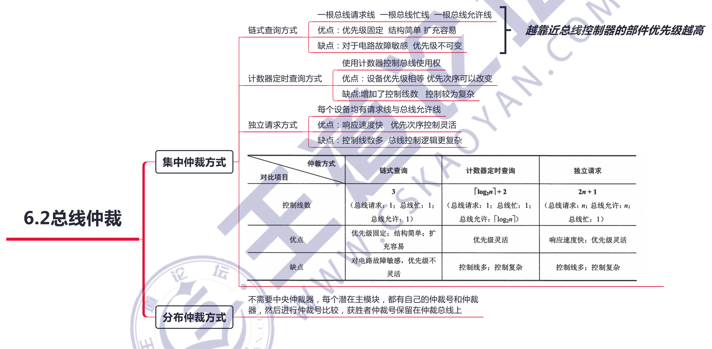
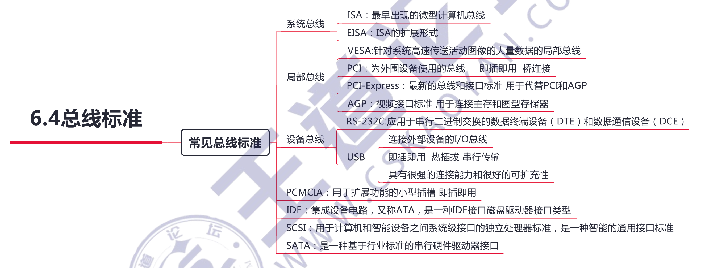

# 总线

## 6.1 总线概述

## 6.2 总线仲裁

目的：为解决多个主设备同时竞争总线控制权的问题，应当采用总线仲裁部件，以某种方式选择一个主设备优先获得总线控制权。只有获得了总线控制权的设备，才能开始传送数据。

- 集中仲裁方式，总线控制逻辑基本上集中于一个设备（如 CPU)中。将所有的总线请求集中起来，利用一个特定的裁决算法进行裁决，称为集中仲裁方式。
- 分布仲裁方式，不需要中央仲裁器，每个潜在的主模块都有自己的仲裁号和仲裁器。当它们有总线请求时，就会把它们各自唯一的仲裁号发送到共享的仲裁总线上，每个仲裁器将从仲裁总线上得到的仲裁号与自己的仲裁号进行比较。若仲裁总线上的仲裁号优先级高，则它的总线请求不子响应，并撤销它的仲裁号。最后，获胜者的仲裁号保留在仲裁总线上。

## 6.3 总线传输和定时

「总线定时」是指总线在双方交换数据的过程中需要时间上配合关系的控制，这种控制称为总线定时，**其实质是一种协议或规则**，主要有同步和异步两种基本定时方式。

## 6.4 总线标准

总线标准是国际上公布或推荐的互连各个模块的标准，是把各种不同的模块组成计算机系统时必须遵守的规范。

按总线标准设计的接口可视为通用接口，在接口的两端，任何一方只需根据总线标准的要求完成自身方面的功能要求，市无须了解对方接口的要求

## 常见问题

### 1）引入总线结构有什么好处？

- 简化了系统结构，便于系统设计制造。
- 大大减少了连线数目，便于布线，减小体积，提高系统的可靠性
- 便于接口设计，所有与总线连接的设备均采用类似的接口
- 便于系统的扩充、更新与灵活配置，易于实现系统的模块化
- 便于设备的软件设计，所有接口的软件对不同的接口地址进行操作
- 便于故障诊断和维修，同时也能降低成本

### 2）引入总线会导致什么问题？如何解决？

引入总线后，总线上的各个设备分时共享同一总线，**当总线上多个设备同时要求使用总线时就会导致总线的冲突**。

为解决多个主设各同时竞争总线控制权的问题，应当采用「总线仲裁」部件，以某种方式选择一个主设备优先获得总线控制权，只有获得了 总线控制权的设备才能开始数据传送。

### 3）同一个总线不能既采用同步方式又采用异步方式通信吗？

**半同步通信总线可以**。这类总线既保留了同步通信的特点，又能采用异步应答方式连接速度相差较大的设备。通过在异步总线中引入时钟信号，其就绪和应答等信号都在时钟的上升沿或下降沿有效，而不受其他时间的信号干扰。

### 4）一个总线在某一时刻可以有多对主从设备进行通信吗？

不可以。**在某个总线周期内，总线上只有一个主设备控制总线**，选择一个从设备与之进行通信（即一对一的关系），或对所有设备进行广播通信(即一对多的关系）。

所以一个总线在某一时刻不能有多对主从设备进行通信，否则**会发生数据冲突**。