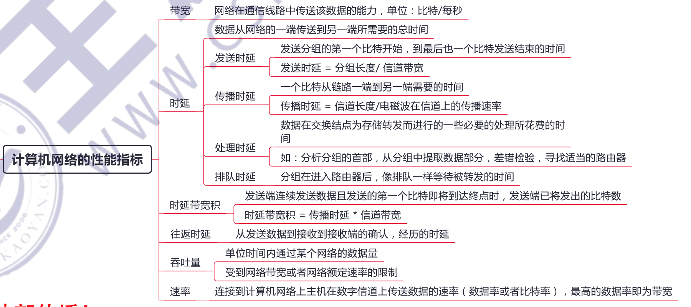
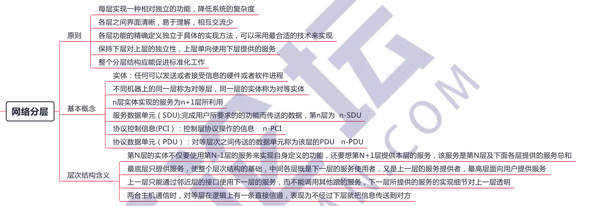

# 网络体系结构

## 1.1 计算机网络概述

按交换技术分类：

**1）电路交换网络**

**在源结点和目的结点之间建立一条专用的通路用于传送数据**，包括建立连接、传输数据和断开连接三个阶段。最典型的电路交换网是传统电话网络。

该类网络的主要特点是整个报文的比特流连续地从源点直达终点，好像是在一条管道中传送。优点是数据直接传送、时延小。缺点是线路利用率低、不能充分利用线路容量、不便于进行差错控制。

**2）报文交换网络**

**用户数据加上源地址、目的地址、校验码等辅助信息，然后封装成报文。整个报文传送到相邻结点，全部存储后，再转发给下一个结点，重复这一过程直到到达目的结点**。每个报文可以单独选择到达目的结点的路径。

报文交换网络也称存储-转发网络，主要特点是整个报文先传送到相邻结点，全部存储后查找转发表，转发到下一个结点。优点是可以较为充分地利用线路容量，可以实现不同链路之间不同数据传输速率的转换，可以实现格式转换，可以实现一对多、多对一的访问，可以实现差错控制。缺点是增大了资源开销 （如辅助信息导致处理时间和存储资源的开销），增加了缓冲时延，需要额外的控制机制来保证多个报文的顺序不乱序，缓冲区难以管理（因为报文的大小不确定，接收方在接收到报文之前不能预知报文的大小)。

**3）分组交换网络**

也称包交换网络。其原理是，**将数据分成较短的固定长度的数据块，在每个数据块中加上目的地址、源地址等辅助信息组成分组（包），以存储-转发方式传输**。其主要特点是单个分组（它只是整个报文的一部分）传送到相邻结点，存储后查找转发表，转发到下一个结点。除具备报文交换网络的优点外，分组交换网络还具有自身的优点：缓冲易于管理；包的平均时延更小，网络占用的平均缓冲区更少；更易于标准化；更适合应用。现在的主流网络基本上都可视为分组交换网络。

信道利用率：某一信道有百分之多少的时间是有数据通过的，即信道利用率 = 有数据通过时间/(有+无)数据通过时间

## 1.2 计算机网络体系结构与参考模型

