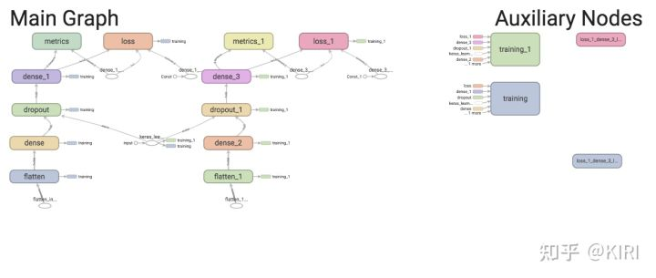
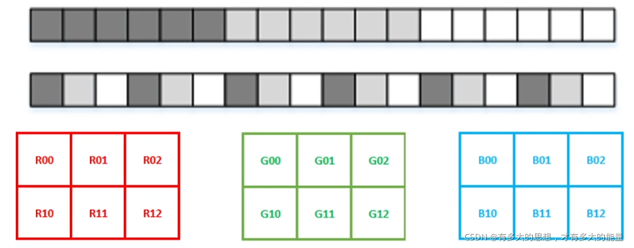
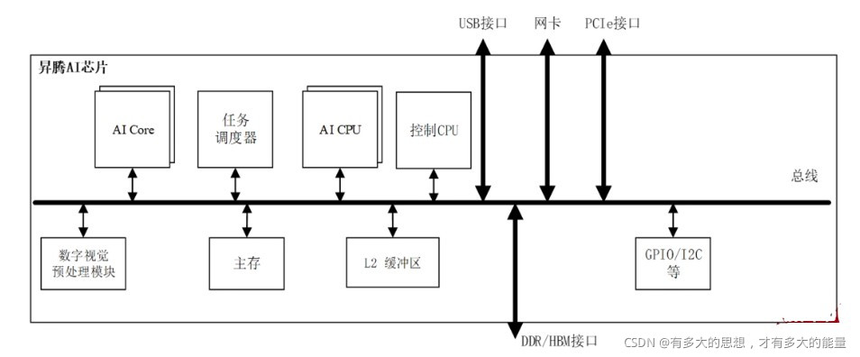
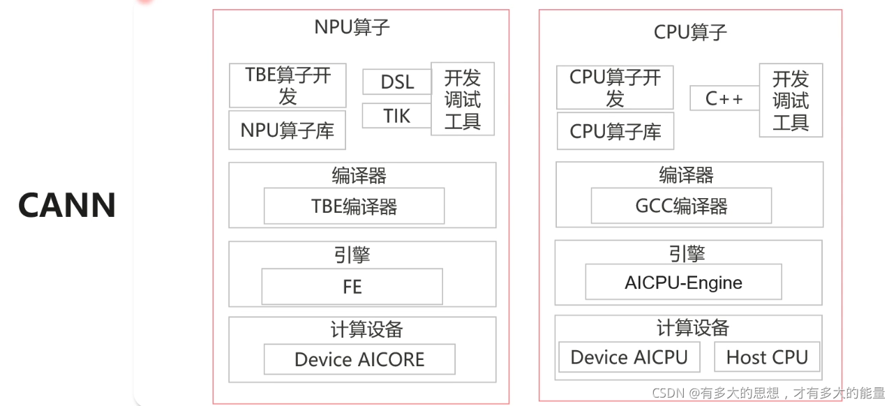

# 算子开发

## 一、算子是什么

可以将算子理解为神经网络计算图的计算节点。计算图是神经网络模型的底层表达，神经网络模型可以当作一个有向无环图。对某一层执行的ReLU激活操作、对卷积输入执行的填充操作都是算子。

**推理侧对模型的加速策略，有些是围绕算子展开。比如算子融合，将常见且有相互关系的多个算子融合为一个，可以减少内存读写次数提高模型执行速度**。 

**在NN模型训练或者推理过程中，将第三方开源框架转化为适配 kirin 处理器的模型时遇到了不支持的算子**。

### 1、Tensorflow 角度理解


Tensorflow 是一个多语言的项目，Tensorflow 的底层功能主要由 C 与 C++ 实现，并在此基础上派生出了 Python api、Java api、C++ api。因为 Python 相较于 C++ 这种静态语言，能支持交互式编程写起来比较舒服，基本上都是 python 来写训练模型的脚本，而在线上部署模型的时候 C++、Java 使用的频率更多。等这个系列博客结束之后，有时间我们会继续介绍 Tensorflow 部署的相关内容。

用 Tensorflow 训练模型的时候，在模型跑起来之前会看到这段日志：

```
[INFO] Graph was finalized
```

Tensorflow 定义了一个图，Tensorflow 实际运行的时候会先将 python 代码定义的网络结构解析为一个有向无环的计算图，通过这个计算图再调度计算资源运行模型。熟悉 Tensorflow 的读者通过 TensorBoard 可以浏览计算图的全貌，如下图所示：



这个计算图中的每一个节点，除了输入和输出节点外，每个中间的节点都代表对张量 (Tensor) 的一个操作。从 checkpoint 目录下的 graph.pbtxt 文件中，我们可以找到每一个节点的结构，例如一个矩阵乘法的节点：

```json
node {
   name: "dnn/dense/MatMul"
   op: "MatMul"
   input: "dnn/input_layer/Reshape_143"
   input: "dense/kernel/read"
   attr {
     key: "T"
     value {
       type: DT_FLOAT
     }
   }
   省略 ...
 }
```

我们可以看到每个节点有几个域：name、op、input、attr，其中 name、input、attr 都很容易理解，分别是节点的名字、输入 tensor 以及节点的额外属性，**op 则是我们这个系列博客的主题——算子(Operator)，张量操作的具体实现**。代码块中的 *MatMul* 就是矩阵乘法算子。如果我们在 Python 代码中使用了`tf.matmul` 函数，Tensorflow 就会在计算图中生成一个 *MatMul* 节点，在加载模型的时候，会对将计算图进行编译，此时根据节点的 op 域从运行时的上下文中调用 *MatMul* 算子对应的内核(kernel)，例如 cpu 环境下调用的是 *MatMul* 算子的 cpu 内核，gpu 环境下调用的是 gpu 内核。相当于算子类似 C++ 的抽象类，定义了张量操作的接口，kernel 是抽象类的实现。通过动态代理根据运行时的上下文采用不同的实现。

### 2、算子

算子是一个函数空间到函数空间上的映射O：X->X；广义的讲，对任何函数进行某一项操作都可以认为是一个算子。在Caffe中，算子对应层中的计算逻辑，例如：卷积层中的卷积算法，是一个算子；全连接层中的权值求和过程，是一个算子。

算子举例：在网络模型中被用作激活函数的算子：tanh、ReLU、Sigmoid等

#### 1、张量（Tensor）

Tensor是算子中的数据，包括输入数据与输出数据，TensorDesc是对输入输出数据与输出数据的描述，TensorDesc数据结构包含如下属性：

| 属性                   | 定义                                                         |
| ---------------------- | ------------------------------------------------------------ |
| 名称（name）           | 用于定义Tensor进行索引，不同Tensor的name需要保持唯一         |
| 形状（shape）          | Tensor的形状，比如（10，）或者（1024，1024）或者（2，3，4）等 |
| 数据类型（dtype）      | 功能描述：指定Tensor对象的数据类型                           |
| 数据排布格式（format） | 多个维度的排布顺序                                           |

#### 2、张量的形状（Shape）

张量的形状，以（D0,D1,…Dn-1）的形式表示，D0到Dn是任意的正整数

| 张量                                 | 形状      |
| ------------------------------------ | --------- |
| 1                                    | （0，）   |
| [1，2，3]                            | （3，）   |
| [[1，2]，[3，4]]                     | （2，2）  |
| [[[1，2]，[3，4]]，[[5，6]，[7，8]]] | (2，2，2) |

#### 3、张量的物理含义

假设有一个shape=(4,20,20,3)。该shape表示有4张图片，宽高都是20，即20*20=400个像素，每个像素点由RGB三原色组成

#### 4、数据排布格式（Format）

- 在深度学习框架中，多维数据通过多维数组存储，比如卷积神经网络的特征图用四维数组保存，四个维度分别为批量大小（Batch，N）、特征图高度（Height，H）、特征图宽度（Width，W）以及特征图通道（Channels，C）
- 由于数据只能线性存储，因为这四个维度由相应的顺序。不同深度学习框架会按照不同的顺序存储特征图数据，比如Caffe，排布顺序为[Batch，Channels，Height，Width]，即NCHW。TensorFlow中，排列顺序为[Batch，Height，Width，Channels]，即NHWC
- 如下图所示，以一 张格式为RGB的图为例，NCHW实际存储的是“RRRGGGBBB"，同一通道的所有像素值顺序存储在一起。而NHWC实际存储的则是"RGBRGBRGB"，多个通道的同一位置的像素值顺序存储在一起



## 二、AI CPU算子是什么

AI CPU算子是华为结合自己AI加速芯片特点提供的一类算子。华为的AI 推理加速芯片Ascend310内部主要分为两部分。一部分用于矩阵加速运算的NPU模块，另一部分为CPU模块用于运行操作系统或者执行复杂逻辑计算。AI CPU算子指利用这些CPU资源实现的神经网络算子。

AI CPU算子使用C++作为开发语言。

### CANN算子

#### 1、Ascend 310处理器逻辑架构（AI Inference SoC）

**AI Core**

昇腾AI芯片的计算核心，负责执行矩阵、向量、标量计算密集的算子任务，采用达芬奇架构。Ascend 310集成了2个AI Core

**ARM CPU核心**

集成了8个ARM A55。其中一部分部署为AI CPU，负责执行不适合跑在AI Core上的算子（承担非矩阵类复杂计算）；一部分部署为专用于控制芯片整体运行的控制CPU。两类任务占用的CPU核数可由软件根据系统实际运行情况动态分配。此外，还部署了一个专用CPU作为任务调度器（Task Scheduler，TS），以实现计算任务在AI Core上的高效分配和调度；该CPU专门服务于AI Core和AI CPU，不承担任何其他工作



**CANN算子**

- NPU算子：通过TBE编译器编译后，可以运行在Device NPU中的AI Core上算子
- CPU算子：通过GCC编译器编译后，可以运行在Host CPU和Device NPU中的AICPU上的算子



####  2、AI CPU

AI CPU算子，是指运行在昇腾AI处理器AI CPU计算单元上的表达一个完整计算逻辑的运算，需要开发者自定义AI CPU算子的情况主要有以下两种：

- 在NN模型训练或者推理过程中，将第三方开源框架转化为适配昇腾AI处理器的模型时遇到了昇腾AI处理器不支持的算子。此时，为了快速打通模型执行流程，用户可以通过自定义AI CPU算子进行功能调测，提升调测效率。功能调通后，后续性能调测过程中再将AI CPU自定义算子转换成TBE自定义算子的实现。
- 某些场景下，无法通过AI Core实现自定义算子（比如部分算子需要Int64类型，但AI Core指令不支持），且该算子不是网络的性能瓶颈，此时可以通过开发AI CPU自定义算子实现昇腾AI处理器对此算子的支持。

#### 3、AI CPU算子执行流程

流程说明：

- 1 第三方框架介入，caffe/tensorflow等等，经过Parse解析后转换为中间态的IR Graph
- 2 GE接收到IR Graph后对图进行优化以及拆分
- 3 拆分过程中，优先由FE基于TBE算子信息库判断算子支持度，若不支持则由AICPU Engine基于AI CPU算子信息库判断是否支持
- 4 GE拆分后的图进行合并为可执行的整图
- 5 在图执行阶段，根据任务类型将AICPU的任务下发AICPU进行算子执行

关键概念：

- 算子Parser：将第三方框架的算子转换为内部算子IR，Caffe框架针对Layer进行处理，TensorFlow针对Operator进行处理
- 算子IR：算子对外API，定义算子的输入、输出、属性，还有算子的形状推导逻辑
- 算子信息库：描叙算子的支持度
- 算子实现库：算子的运算逻辑


## 三、AI CPU算子开发流程

AI CPU算子开发涉及算子算子原型库、算子信息库、算子实现、算子适配插件。

当然还需要准备算子编译工程，本文使用华为 [https://gitee.com/ascend/samples.git](https://link.zhihu.com/?target=https%3A//gitee.com/ascend/samples.git) 库

cplusplus\level1_single_api\4_op_dev\1_custom_op 目录下的算子工程。

### 1、算子原型库

算子原型库由.h头文件和.cc实现文件组成。头文件描绘算子作为计算节点的输入数据、输出数据以及控制算子运行的属性参数。需要特别注意，输入和输出是张量。简而言之，算子原型库头文件是AI CPU算子的接口。

如何算子原型库头文件？我们一般是开发推理端不支持的算子，所以算子原型库需要根据不同框架下算子。比如Pytorch框架实现Pading算子，但推理平台不支持。我们就需要根据Pytorch的Pading算子相关文档，识别出哪些参数是输入、输出和属性。

```c++
 namespace ge {
 REG_OP(PadCustom)
 .INPUT(x, TensorType({DT_FLOAT16, DT_FLOAT }))//指定算子接受的数据类型
 .OUTPUT(y, TensorType({DT_FLOAT16, DT_FLOAT }))//指定算子输出参数的数据类型
 .REQUIRED_ATTR(paddings, ListInt)//属性  
 .ATTR(mode, String, "constant") //属性
 .ATTR(paddings_contiguous, Bool, true) //属性
 .ATTR(constant_values, Int, 0) //属性
 .OP_END_FACTORY_REG(PadCustom)
}
```

算子原型库实现文件用于算子输出尺寸推断和输入校验。这样的设计有利于在编译阶段了解计算图对内存空间的需求，并预先开辟内存。

### 2、算子信息库

AI CPU算子和基于NPU实现的TBE算子共享一个算子原型库。如果一个算子在AI CPU和NPU上都有实现，就需要通过算子信息库文件判断应该选择哪个算子实现。

同一个算子为什么会有不同实现。因为NPU虽然能加速运算但精度不高，如果当前算子使用者指定了高精度，那就需要在AI CPU上实现。

### 3、算子实现

算子实现文件用于实现算子逻辑功能。在进行算子原型定义时，我们填写了不同数据类型，在算子实现文件中我们需要为每一种数据类型实现逻辑功能。所以，很自然需要使用C++的模板函数。

### 4、算子适配插件

算子适配用于完成华为算子（AI CPU和TBE算子）与第三方框架算子对接。对接完成，进行模型转换就能正确调用自定义算子。

```c++
REGISTER_CUSTOM_OP("PadCustom")
 .FrameworkType(ONNX)
 .OriginOpType({ge::AscendString("ai.onnx::10::Pad")})
 .ParseParamsByOperatorFn(ParseOnnxParamsPad)
 .ImplyType(ImplyType::AI_CPU);
} 
```

### 5、AI CPU算子开发流程


**AI CPU算子开发流程-算子分析**

使用AI CPU方式开发算子前，先确定算子功能、输入、输出、算子开发方式、算子类型以及算子实现函数名称等

**1.明确算子的功能，若涉及到数学表达式，需要分析数学表达式**

例如：

```
z = x < y ? true : false
```

**2.明确输入和输出**

```
REG_OP(Less)
.INPUT(X1,TensorType({DT_FLOAT,DT_FLOAT16,DT_DOUBLE,DT_UINT8,DT_INT8,DT_UINT16,DT_INT16,DT_INT32,DT_INT64}))
.INPUT(X2,TensorType({DT_FLOAT,DT_FLOAT16,DT_DOUBLE,DT_UINT8,DT_INT8,DT_UINT16,DT_INT16,DT_INT32,DT_INT64}))
.OUTPUT(y,TensorType({DT_BOOL}))
.OP_END_FACTORY_REG(Less)
```

**3.明确算子实现文件名称以及算子的类型（OpType）**

| 算子类型         | 算子名称、形状       | data type                                                    | 数据排布格式   |
| ---------------- | -------------------- | ------------------------------------------------------------ | -------------- |
| 算子输入         | name：x1；shape：all | float16、float32、double、int8、int16、int32、int64、uint8、uint16、uint32、uint64 | NCHW、NHWC、ND |
| 算子输入         | name：x2；shape：all | float16、float32、double、int8、int16、int32、int64、uint8、uint16、uint32、uint64 | NCHW、NHWC、ND |
| 算子输出         | name：y；shape：all  | bool                                                         | NCHW、NHWC、ND |
| 算子实现文件名称 | less                 |                                                              |                |

## Reference

[华为AI CPU算子开发](https://zhuanlan.zhihu.com/p/522206078)

[从零开始掌握 tensorflow 算子开发](https://zhuanlan.zhihu.com/p/423413103)

[CANN-AICPU算子开发](https://blog.csdn.net/qq_37190108/article/details/121156228)

