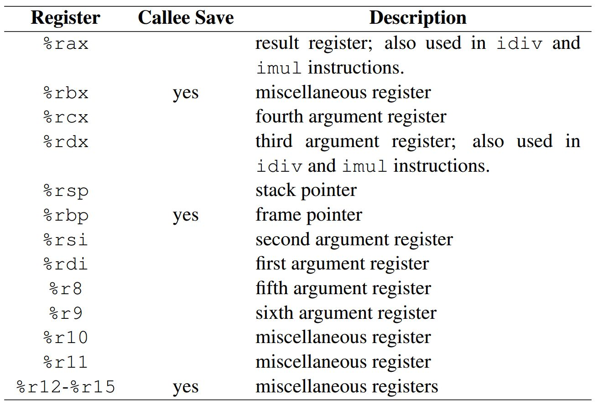
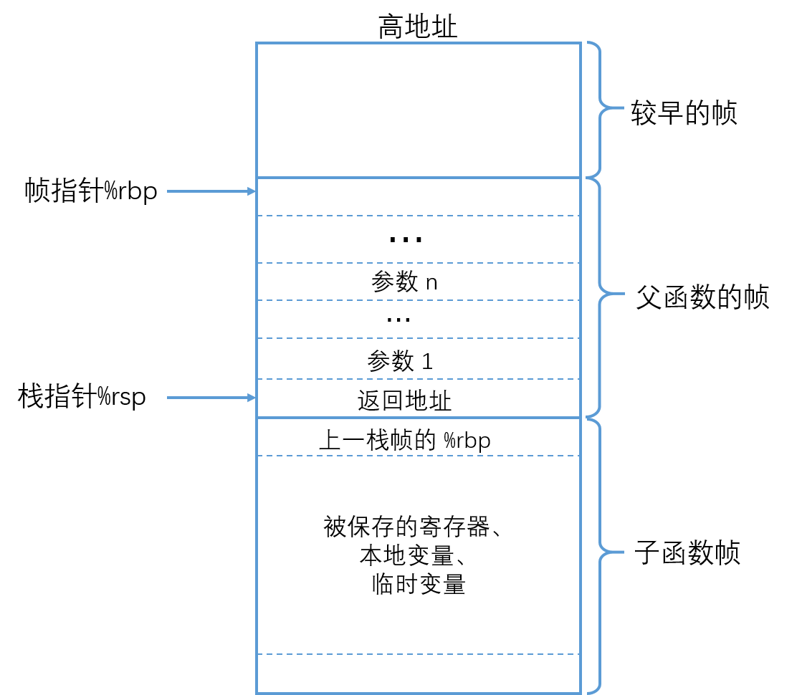
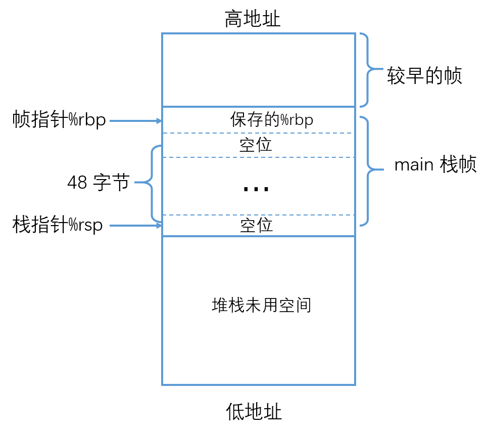

# x86-64 下函数调用及栈帧原理

来源：https://zhuanlan.zhihu.com/p/27339191

## 缘起

在 C/C++ 程序中，函数调用是十分常见的操作。那么，这一操作的底层原理是怎样的？编译器帮我们做了哪些操作？CPU 中各寄存器及内存堆栈在函数调用时是如何被使用的？栈帧的创建和恢复是如何完成的？针对上述问题，本本文进行了探索和研究。

## 通用寄存器使用惯例

函数调用时，在硬件层面我们需要关注的通常是cpu 的通用寄存器。

在所有 cpu 体系架构中，每个寄存器通常都是有建议的使用方法的，而编译器也通常依照CPU架构的建议来使用这些寄存器，因而我们可以认为这些建议是强制性的。

对于 x86-64 架构，共有16个64位通用寄存器，各寄存器及用途如下图所示：



从上图中，我们可以得到如下结论：

- 每个寄存器的用途并不是单一的。
- %rax 通常用于存储函数调用的返回结果，同时也用于乘法和除法指令中。在imul 指令中，两个64位的乘法最多会产生128位的结果，需要 %rax 与 %rdx 共同存储乘法结果，在div 指令中被除数是128 位的，同样需要%rax 与 %rdx 共同存储被除数。
- %rsp 是堆栈指针寄存器，通常会指向栈顶位置，堆栈的 pop 和 push 操作就是通过改变 %rsp 的值即移动堆栈指针的位置来实现的。
- %rbp 是栈帧指针，用于标识当前栈帧的起始位置
- %rdi, %rsi, %rdx, %rcx,%r8, %r9 六个寄存器用于存储函数调用时的6个参数（如果有6个或6个以上参数的话）。
- 被标识为 “miscellaneous registers” 的寄存器，属于通用性更为广泛的寄存器，编译器或汇编程序可以根据需要存储任何数据。

这里还要区分一下 “Caller Save” 和 ”Callee Save” 寄存器，即寄存器的值是由”调用者保存“ 还是由 ”被调用者保存“。当产生函数调用时，子函数内通常也会使用到通用寄存器，那么这些寄存器中之前保存的调用者(父函数）的值就会被覆盖。为了避免数据覆盖而导致从子函数返回时寄存器中的数据不可恢复，CPU 体系结构中就规定了通用寄存器的保存方式。

- 如果一个寄存器被标识为”Caller Save”， 那么在进行子函数调用前，就需要由调用者提前保存好这些寄存器的值，保存方法通常是把寄存器的值压入堆栈中，调用者保存完成后，在被调用者（子函数）中就可以随意覆盖这些寄存器的值了。
- 如果一个寄存被标识为“Callee Save”，那么在函数调用时，调用者就不必保存这些寄存器的值而直接进行子函数调用，进入子函数后，子函数在覆盖这些寄存器之前，需要先保存这些寄存器的值，即这些寄存器的值是由被调用者来保存和恢复的。

## 函数的调用

子函数调用时，调用者与被调用者的栈帧结构如下图所示：


在子函数调用时，执行的操作有：父函数将调用参数从后向前压栈 -> 将返回地址压栈保存 -> 跳转到子函数起始地址执行 -> 子函数将父函数栈帧起始地址（%rpb） 压栈 -> 将 %rbp 的值设置为当前 %rsp 的值，即将 %rbp 指向子函数栈帧的起始地址。

上述过程中，保存返回地址和跳转到子函数处执行由 call 一条指令完成，在call 指令执行完成时，已经进入了子程序中，因而将上一栈帧%rbp 压栈的操作，需要由子程序来完成。函数调用时在汇编层面的指令序列如下：

```assembly
...   		# 参数压栈
call FUNC  	# 将返回地址压栈，并跳转到子函数 FUNC 处执行
...  		# 函数调用的返回位置

FUNC:  				# 子函数入口
pushq %rbp  		# 保存旧的帧指针，相当于创建新的栈帧
movq  %rsp, %rbp  	# 让 %rbp 指向新栈帧的起始位置 %rbp的值付给%rsp
subq  $N, %rsp  	# 在新栈帧中预留一些空位，供子程序使用，用 (%rsp+K) 或 (%rbp-K) 的形式引用空位
```

保存返回地址和保存上一栈帧的%rbp 都是为了函数返回时，恢复父函数的栈帧结构。在使用高级语言进行函数调用时，由编译器自动完成上述整个流程。对于”Caller Save” 和 “Callee Save” 寄存器的保存和恢复，也都是由编译器自动完成的。

需要注意的是，父函数中进行参数压栈时，顺序是从后向前进行的。但是，这一行为并不是固定的，是依赖于编译器的具体实现的，在gcc 中，使用的是从后向前的压栈方式，这种方式便于支持类似于 printf(“%d, %d”, i, j) 这样的使用变长参数的函数调用。

## 函数的返回

函数返回时，我们只需要得到函数的返回值（保存在 %rax 中），之后就需要将栈的结构恢复到函数调用之差的状态，并跳转到父函数的返回地址处继续执行。由于函数调用时已经保存了返回地址和父函数栈帧的起始地址，要恢复到子函数调用之前的父栈帧，我们只需要执行以下两条指令：

```assembly
movq %rbp, %rsp	# 使 %rsp 和 %rbp 指向同一位置，即子栈帧的起始处 %rsp的值付给$rbp
popq %rbp 		# 将栈中保存的父栈帧的 %rbp 的值赋值给 %rbp，并且 %rsp 上移一个位置指向父栈帧的结尾处
```

为了便于栈帧恢复，x86-64 架构中提供了 leave 指令来实现上述两条命令的功能。执行 leave 后，前面图中函数调用的栈帧结构如下：



可以看出，调用 leave 后，%rsp 指向的正好是返回地址，x86-64 提供的 ret 指令，其作用就是从当前 %rsp 指向的位置（即栈顶）弹出数据，并跳转到此数据代表的地址处，在leave 执行后，%rsp 指向的正好是返回地址，因而 ret 的作用就是把 %rsp 上移一个位置，并跳转到返回地址执行。可以看出，leave 指令用于恢复父函数的栈帧，ret 用于跳转到返回地址处，leave 和ret 配合共同完成了子函数的返回。当执行完成 ret 后，%rsp 指向的是父栈帧的结尾处，父栈帧尾部存储的调用参数由编译器自动释放。

## 函数调用示例

为了更深入的了解函数调用原理，我们可以使用一个程序示例来观察函数的调用和返回。程序如下：

```c
int add(int a, int b, int c, int d, int e, int f, int g, int h) { // 8 个参数相加
  int sum = a + b + c + d + e + f + g + h;
  return sum;
}

int main(void) {
  int i = 10;
  int j = 20;
  int k = i + j;
  int sum = add(11, 22,33, 44, 55, 66, 77, 88);
  int m = k; // 为了观察 %rax Caller Save 寄存器的恢复

  return 0;
}
```

在main 函数中，首先进行了一个 k=i+j 的加法，这是为了观察 Caller Save 效果。因为加法会用到 %rax，而下面 add 函数的返回值也会使用 %rax。由于 %rax 是 Caller Save 寄存器，在调用 add 子函数之前，程序应该先保存 %rax 的值。

add 函数使用了 8 个参数，这是为了观察当函数参数多于6个时程序的行为，前6个参数会保存到寄存器中，多于6个的参数会保存到堆栈中。但是，由于在子程序中可能会取参数的地址，而保存在寄存器中的前6个参数是没有内存地址的，因而我们可以猜测，保存在寄存器中的前6个参数，在子程序中也会被压入到堆栈中，这样才能取到这6个参数的内存地址。上面程序生成的和子函数调用相关的汇编程序如下：

```assembly
add:
.LFB2:
    pushq    %rbp
.LCFI0:
    movq    %rsp, %rbp
.LCFI1:
    movl    %edi, -20(%rbp)
    movl    %esi, -24(%rbp)
    movl    %edx, -28(%rbp)
    movl    %ecx, -32(%rbp)
    movl    %r8d, -36(%rbp)
    movl    %r9d, -40(%rbp)
    movl    -24(%rbp), %eax
    addl    -20(%rbp), %eax
    addl    -28(%rbp), %eax
    addl    -32(%rbp), %eax
    addl    -36(%rbp), %eax
    addl    -40(%rbp), %eax
    addl    16(%rbp), %eax
    addl    24(%rbp), %eax
    movl    %eax, -4(%rbp)
    movl    -4(%rbp), %eax
    leave
    ret

main:
.LFB3:
    pushq    %rbp
.LCFI2:
    movq    %rsp, %rbp
.LCFI3:
    subq    $48, %rsp
.LCFI4:
    movl    $10, -20(%rbp)
    movl    $20, -16(%rbp)
    movl    -16(%rbp), %eax
    addl    -20(%rbp), %eax
    movl    %eax, -12(%rbp)
    movl    $88, 8(%rsp)
    movl    $77, (%rsp)
    movl    $66, %r9d
    movl    $55, %r8d
    movl    $44, %ecx
    movl    $33, %edx
    movl    $22, %esi
    movl    $11, %edi
    call    add
    movl    %eax, -8(%rbp)
    movl    -12(%rbp), %eax
    movl    %eax, -4(%rbp)
    movl    $0, %eax
    leave
    ret
```

在汇编程序中，如果使用的是64位通用寄存器的低32位，则寄存器以 ”e“ 开头，比如 %eax，%ebx 等，对于 %r8-%r15，其低32 位是在64位寄存后加 “d” 来表示，比如 %r8d, %r15d。如果操作数是32 位的，则指令以 ”l“ 结尾，例如 movl $11, %esi，指令和寄存器都是32位的格式。如果操作数是64 位的，则指令以 q 结尾，例如 “movq %rsp, %rbp”。由于示例程序中的操作数全部在32位的表示范围内，因而上面的加法和移动指令全部是用的32位指令和操作数，只有在创建栈帧时为了地址对齐才使用的是64位指令及操作数。

首先看 main 函数的前三条汇编语句：

```assembly
.LFB3:
    pushq    %rbp
.LCFI2:
    movq    %rsp, %rbp
.LCFI3:
    subq    $48, %rsp
```

这三条语句保存了父函数的栈帧（注意main函数也有父函数），之后创建了main 函数的栈帧并且在栈帧中分配了48Byte 的空位，这三条语句执行完成后，main 函数的栈帧如下图所示：



之后，main 函数中就进行了 k=i+j 的加法和 add 参数的处理：

```assembly
    movl    $10, -20(%rbp)
    movl    $20, -16(%rbp)
    movl    -16(%rbp), %eax
    addl    -20(%rbp), %eax
    movl    %eax, -12(%rbp)  # 调用子函数前保存 %eax 的值到栈中，caller save
    movl    $88, 8(%rsp)
    movl    $77, (%rsp)
    movl    $66, %r9d
    movl    $55, %r8d
    movl    $44, %ecx
    movl    $33, %edx
    movl    $22, %esi
    movl    $11, %edi
    call    add
```

在进行 k=i+j 加法时，使用 main 栈空间的方式较为特别。并不是按照我们通常认为的每使用一个栈空间就会进行一次push 操作，而是使用之前预先分配的 48 个空位，并且用 -N(%rbp) 即从 %rbp 指向的位置向下计数的方式来使用空位的，本质上这和每次进行 push 操作是一样的，最后计算 i+j 得到的结果 k 保存在了 %eax 中。之后就需要准备调用 add 函数了。

我们知道，add 函数的返回值会保存在 %eax 中，即 %eax 一定会被子函数 add 覆盖，而现在 %eax 中保存的是 k 的值。在 C 程序中可以看到，在调用完成 add 后，我们又使用了 k 的值，因而在调用 add 中覆盖 %eax 之前，需要保存 %eax 值，在add 使用完%eax 后，需要恢复 %eax 值（即k 的值），由于 %eax 是 Caller Save的，应该由父函数main来保存 %eax 的值，因而上面汇编中有一句 “movl %eax, -12(%rbp)” 就是在调用 add 函数之前来保存 %eax 的值的。

对于8个参数，可以看出，最后两个参数是从后向前压入了栈中，前6个参数全部保存到了对应的参数寄存器中，与本文开始描述的一致。

进入 add 之后的操作如下：

```assembly
add:
.LFB2:
    pushq    %rbp 			# 保存父栈帧指针
.LCFI0:
    movq    %rsp, %rbp  	# 创建新栈帧
.LCFI1:
    movl    %edi, -20(%rbp)	# 在寄存器中的参数压栈
    movl    %esi, -24(%rbp)
    movl    %edx, -28(%rbp)
    movl    %ecx, -32(%rbp)
    movl    %r8d, -36(%rbp)
    movl    %r9d, -40(%rbp)
    movl    -24(%rbp), %eax
    addl    -20(%rbp), %eax
    addl    -28(%rbp), %eax
    addl    -32(%rbp), %eax
    addl    -36(%rbp), %eax
    addl    -40(%rbp), %eax
    addl    16(%rbp), %eax
    addl    24(%rbp), %eax
    movl    %eax, -4(%rbp)
    movl    -4(%rbp), %eax
    leave
    ret
```

add 中最前面两条指令实现了新栈帧的创建。之后把在寄存器中的函数调用参数压入了栈中。在本文前面提到过，由于子程序中可能会用到参数的内存地址，这些参数放在寄存器中是无法取地址的，这里把参数压栈，正好印证了我们之前的猜想。

在参数压栈时，我们看到并未使用 push 之类的指令，也没有调整 %esp 指针的值，而是使用了 -N(%rbp) 这样的指令来使用新的栈空间。这种使用”基地址+偏移量“ 来使用栈的方式和直接使用 %esp 指向栈顶的方式其实是一样的。

这里有两个和编译器具体实现相关的问题：一是上面程序中，-8(%rbp) 和 -12(%rbp) 地址并未被使用到，这两个地址之前的地址 -4(%rbp) 和之后的 -16(%rsp) 都被使用到了，这可能是由于编译器具体的实现方式来决定的。另外一个就是如下两条指令：

```assembly
    movl    %eax, -4(%rbp)
    movl    -4(%rbp), %eax
```

先是把 %eax 的值赋值给的 -4(%rbp)，之后又逆向赋值了一次，猜测可能是编译器为了通用性才如此操作的。以上两个问题需要后续进一步研究。

当add函数返回后，返回结果会存储在%eax 中，%rbp 和 %rsp 会调整为指向 main 的栈帧，之后会执行main 函数中的如下指令：

```assembly
movl    %eax, -8(%rbp)  # 保存 add 函数返回值到栈中，对应 C 语句 int sum = add(...)
movl   -12(%rbp), %eax  # 恢复 call save 寄存器 %eax 的值，与调用add前保存 %eax 相对应 
movl    %eax, -4(%rbp) 	# 对应 C 语句 m = k，%eax 中的值就是 k。
movl    $0, %eax 		# main 函数返回值
leave   				# main 函数返回
ret
```

可以看出，当 add 函数返回时，把返回值保存到了 %eax 中，使用完返回值后，会恢复 caller save 寄存器 %eax的值，这时main 栈帧与调用 add 之前完全一样。

需要注意的是，在调用 add 之前，main 中执行了一条 subq 48, %rsp 这样的指令，原因就在于调用 add 之后，main 中并未调用其他函数，而是执行了两条赋值语句后就直接从main返回了。 main 结尾处的 leave、ret 两条指令会直接覆盖 %rsp 的值从而回到 main 的父栈帧中。如果先调整 main 栈帧的 %rsp 值，之后 leave 再覆盖 %rsp 的值，相当于调整是多余的。因而省略main 中 add返回之后的 %rsp 的调整，而使用 leave 直接覆盖%rsp更为合理。

## 结语

本文从汇编层面介绍了X86-64 架构下函数调用时栈帧的切换原理，了解这些底层细节对于理解程序的运行情况是十分有益的。并且在当前许多程序中，为了实现程序的高效运行，都使用了汇编语言，在了解了函数栈帧切换原理后，对于理解这些汇编也是非常有帮助的。